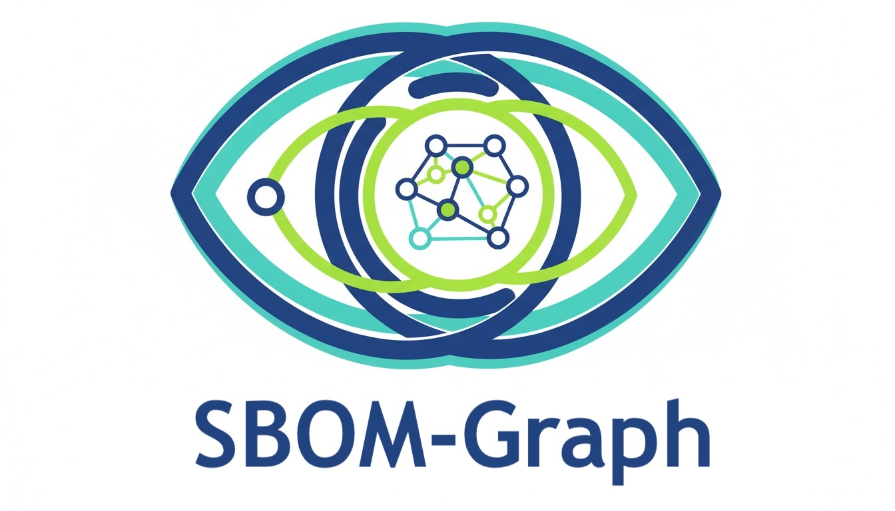

<!-- DO NOT REMOVE: This logo is displayed on GitHub and must remain as the first element in the README. -->


## Tool Overview and Capabilities

The tool processes dependency graphs generated from Software Bill of Materials (SBOM) files and features pre-configured reports and visualizations that deliver actionable insights. Its key capabilities include:

Vulnerability Impact Analysis: Identifies which projects are impacted by a vulnerability and prioritizes fixes based on interdependencies (e.g., determining which project updates must occur first to avoid cascading issues).

Detection of Bad Practices:

- Incorrect version pinning, which can cause runtime errors if improperly executed.
- Circular dependencies.
- Non-Semantic Versioning (Non-SemVer).
- Use of SNAPSHOT versions in production releases.

From the perspectives of AppSec, Architecture, and Engineering, these reports help uncover design flaws, poor practices, and errors. The tool is particularly valuable during zero-day vulnerability scenarios, enabling rapid identification of all affected projects and dependencies.

Strategic Potential and Future Enhancements

The tool also has potential for further enhancements by enriching the graph with additional data points. For example, by incorporating metrics such as the security and quality ratings of libraries, we can enable advanced dependency threat modeling. This will allows you to proactively identify and mitigate risks by replacing less secure libraries with more robust alternatives.

The project is made up of 5 parts:

1. **sbom-graph-model** -- A Python library for processing CycloneDX and SPDX files and storing them in a GraphDB
2. **sbom-graph-api** -- A Flask application for visualizing graph data, ingesting SBOMs (CycloneDX and SPDX) via authenticated API, and providing reports on dependency relationships, vulnerabilities, licenses, policy compliance, and supply-chain trust scores
3. **sbom-graph-enrichment** -- A Celery-based asynchronous enrichment pipeline that queries external APIs (OSV, ClearlyDefined, OpenSSF Scorecard, Sonatype OSS Index, deps.dev, endoflife.date) to enrich package metadata and compute trust scores
4. **sonatype-lifecycle-release-listener** -- A release listener for SCA scans that retrieves the CycloneDX file and processes it
5. **sbom-graph-cli** -- Command-line interface for ingestion, querying, policy annotation, and report export (scripting and CI/CD)

For detailed architecture documentation, see [SPECIFICATION.md](SPECIFICATION.md).
For a full deployment walkthrough (prerequisites, TLS setup, Helm configuration, local and remote Kubernetes), see [GETTING_STARTED.md](GETTING_STARTED.md).

### Features

- **Multi-Format SBOM Ingestion**: Upload CycloneDX and SPDX 2.3 SBOMs via REST API (`POST /ingest/cyclonedx`, `POST /ingest/spdx`, `POST /ingest/sbom` for auto-detect); SBOM provenance tracked with `record_id` in responses; all inbound payloads validated against JSON Schema (Draft-07)
- **Vulnerability Enrichment**: Continuous enrichment from OSV.dev and Sonatype OSS Index catches new CVEs after ingestion
- **License Tracking and Compliance**: Licenses extracted from SBOMs and enriched via ClearlyDefined, grouped by risk category (Copyleft, Weak Copyleft, Permissive), with conflict detection
- **VEX Support**: Ingest OpenVEX documents to communicate whether a vulnerability actually affects a product, with coverage statistics
- **Patch Planning and Blast Radius**: Frontier-level patch plans for vulnerabilities and blast radius analysis for compromised packages
- **Policy Annotations**: Mark packages as approved/denied/hold (certifyBad/certifyGood) with CI/CD gate endpoints for binary authorisation
- **Source Repository Tracking**: Link packages to their source repos for provenance checks and scorecard lookups
- **Supply-Chain Trust Score**: Composite trust scores from OpenSSF Scorecard, OSV, Sonatype OSS Index, and deps.dev with inherited risk propagation and drop alerting (see [dedicated section below](#supply-chain-trust-score))
- **Visualizations**:
  - K-Partite Dependency Visualization with color-coded partition levels
  - Bi-Partite Graph of project versions and their direct dependants
  - Dependants Graph (full reverse dependency tree)
  - Dependencies Graph with multiple layouts (spring, radial, shell, BFS, circular) and cycle detection
  - Interactive layout switcher and cycle edge highlighting
  - Trust score heatmap, risk propagation graph, application risk dashboard, risk path explorer, risk outliers, and what-if simulator
- **Reports**: HTML tables, Excel exports, and JSON exports for:
  - All projects with versions
  - Application inventory with latest-version filtering
  - SNAPSHOT dependencies
  - Self-dependency detection
  - Multi-version dependency source tracking (diamond dependency analysis)
  - Non-SemVer version detection
  - Transitive dependencies (what a version depends on)
  - Dependants with partition levels and paths
  - All vulnerabilities ordered by severity
  - Vulnerability dependants (impact analysis)
  - Centrality metrics (inDegree/outDegree)
  - License inventory and license-per-project summary
  - Vulnerability freshness (enrichment age)
  - Policy violations (banned packages still in use)
  - VEX coverage statistics
  - License conflicts (incompatible licenses in same dependency tree)
  - Source repository inventory
  - Enrichment coverage (recent vs stale vs never-scanned packages)
  - License dashboard (summary by risk category)
  - Trust score gaps (packages without trust scores)
  - Incident response (blast radius and patch plan per vulnerability)
  - Source impact (affected applications by compromised source repo)
  - SBOM inventory (ingested SBOM records)
  - SBOM coverage (provenance coverage per application)
- **Programmatic API (v1)**: JSON-only endpoints for CI/CD pipelines with `{data, pagination?, meta}` envelope. Includes package metadata, dependency/dependant trees, critical dependencies, risk summary, OpenAPI spec, vulnerability lookup, policy checks, trust score gates, and enrichment triggers
- **CLI Tooling**: `sbom-graph` CLI for ingest, query (vulns, deps, dependants, patch-plan), policy annotate, and report export with `--output json` for pipelines
- **Interactive UI Features**:
  - Internal Only Toggle across all reports and visualizations
  - Dynamic download links that respect current filter state
  - Interactive API documentation with forms to test all endpoints
  - Frozen table headers for scrollable data tables

## Project Structure

```
sbom-graph/
├── sbom-graph-model/                        # Python library for CycloneDX/SPDX → FalkorDB
├── sbom-graph-api/                          # Flask API, reports, and visualizations
├── sbom-graph-enrichment/                   # Celery enrichment pipeline (OSV, Scorecard, etc.)
├── sonatype-lifecycle-release-listener/     # SCA scan release listener
├── sbom-graph-cli/                          # CLI for ingest, query, policy, export
├── helm/
│   └── sbom-graph/                          # Umbrella Helm chart for all components
├── build-images.sh                          # Docker build script
├── release.sh                               # Build, tag, push images + update Helm values
├── deploy.sh                                # Helm upgrade/install preserving volumes
├── sync-helm-tags.sh                        # Sync pyproject.toml versions to Helm tags
└── SPECIFICATION.md                         # Detailed architecture documentation
```

## Supply-Chain Trust Score

The trust score provides a single, evidence-based rating (0--10) for every package in the dependency graph by aggregating data from four external sources:

| Source | What It Provides |
|--------|-----------------|
| [OpenSSF Scorecard](https://scorecard.dev) | 18+ security-practice checks (branch protection, code review, SAST, fuzzing, etc.) |
| [OSV Database](https://osv.dev) | Vulnerability count, severity distribution, mean-time-to-fix |
| [Sonatype OSS Index](https://ossindex.sonatype.org) | Proprietary vulnerability intelligence and remediation guidance |
| [deps.dev](https://deps.dev) | Project health, advisory counts, scorecard data, and activity signals |

### Scoring Categories

The composite score is computed across four weighted categories, each normalised to 0--10:

| Category | Default Weight | What It Measures |
|----------|---------------|-----------------|
| Security Practices | 30% | Branch protection, code review, SAST, fuzzing, dangerous workflows |
| Vulnerability Profile | 35% | Open CVE count/severity, fix rate, mean time to remediate |
| Maintenance Health | 20% | Recent activity, contributor count, maintenance signals |
| Supply-Chain Hygiene | 15% | Pinned dependencies, signed releases, CI tests, packaging |

When a data source is unavailable for a category, remaining sources are re-weighted proportionally. A **confidence level** (0--1) is reported alongside every score.

### Inherited Risk Propagation

A package's *direct score* only tells part of the story. A library scoring 9/10 that depends on a library scoring 2/10 is far riskier than its own score suggests. The trust score system computes an **effective score** that reflects aggregate risk through the entire transitive dependency tree:

```
effective_score(v) = α × direct_score(v) + (1 − α) × inherited_score(v)
```

- **α** (default 0.4) controls the balance between own-score and inherited risk
- **Depth attenuation** (decay factor δ = 0.8) reduces influence at each dependency level: direct = 1.0, depth 2 = 0.8, depth 5 ≈ 0.41
- **Minimum-path score** tracks the worst individual component on any path from an application to a leaf node ("weakest link")
- Scores are computed **bottom-up** via reverse topological order; improvements propagate automatically when dependencies are upgraded

### Trust Score Drop Alerting

When a package's effective score falls below `TRUST_SCORE_ALERT_THRESHOLD` (default 4.0), the enrichment pipeline emits WARNING-level log alerts with the top 20 at-risk packages. Configure the threshold via `trustScore.alertThreshold` in Helm values or the `TRUST_SCORE_ALERT_THRESHOLD` environment variable.

### API Endpoints

| Endpoint | Description |
|----------|-------------|
| `GET /api/v1/package/{purl}/trust-score` | Full trust score breakdown: direct, effective, inherited, per-category, confidence |
| `GET /api/v1/package/{purl}/trust-score/risk-path` | Top dependency chains contributing to score degradation |
| `GET /api/v1/application/{purl}/supply-chain-risk` | Application-level aggregate risk with weakest-link and top contributors |
| `GET /api/v1/analysis/trust-score-distribution` | Histogram of effective scores across all packages |
| `GET /api/v1/analysis/remediation-priorities` | Packages ranked by remediation leverage (applications improved per upgrade) |
| `GET /api/v1/package/{purl}/trust-check` | CI/CD gate: pass/fail against minimum effective score threshold |

### CI/CD Gate

The trust-check endpoint is designed for pipeline integration:

```bash
curl -s -H "Authorization: Bearer $TOKEN" \
  "$API_URL/api/v1/package/pkg:maven%2Fcom.example%2Fmy-lib@1.0.0/trust-check?min_score=5.0"
```

Returns a `pass` or `fail` verdict with the package's effective score, confidence, and per-category breakdown. The gate checks the **effective score** (not just the direct score), catching cases where a package looks fine itself but has risky dependencies.

### Configuration

Scoring parameters are configurable via environment variables or Helm values:

| Parameter | Default | Description |
|-----------|---------|-------------|
| `trustScore.enabled` | `true` | Enable/disable trust score computation |
| `trustScore.weights.securityPractices` | `0.30` | Weight for security practices category |
| `trustScore.weights.vulnerabilityProfile` | `0.35` | Weight for vulnerability profile category |
| `trustScore.weights.maintenanceHealth` | `0.20` | Weight for maintenance health category |
| `trustScore.weights.supplyChainHygiene` | `0.15` | Weight for supply-chain hygiene category |
| `trustScore.propagation.alpha` | `0.4` | Own-score vs inherited-score balance |
| `trustScore.propagation.decay` | `0.8` | Per-depth attenuation factor |
| `trustScore.propagation.maxDepth` | `20` | Maximum traversal depth |
| `trustScore.alertThreshold` | `4.0` | Effective score below which WARNING-level alerts are emitted |

## Enrichment Pipeline

The `sbom-graph-enrichment` component is a Celery-based asynchronous worker that continuously enriches package metadata after SBOM ingestion. It runs the following enrichment tasks:

- **Vulnerability Enrichment**: Queries OSV.dev and Sonatype OSS Index for known vulnerabilities, creating `Vulnerability` nodes and `HAS_VULNERABILITY` edges in the graph
- **License Enrichment**: Queries ClearlyDefined for license metadata, categorising licenses by risk (Copyleft, Weak Copyleft, Permissive)
- **EOL Enrichment**: Queries the endoflife.date API for product lifecycle information (end-of-life dates)
- **Source Repository Enrichment**: Queries deps.dev for source repository URLs, with host allowlist for SSRF mitigation
- **Trust Score Computation**: Queries OpenSSF Scorecard, OSV, Sonatype, and deps.dev to compute the composite trust score and propagate inherited risk through the dependency graph

Enrichment tasks can be triggered on-demand via the API (`POST /api/v1/enrich/vulnerabilities`) or run on a configurable schedule. The pipeline is designed to be idempotent: re-running enrichment updates existing nodes rather than creating duplicates.

## Deployment

### Recommended: `release.sh` + `deploy.sh`

Build images (only those that changed), update Helm tags, and deploy:

```bash
./release.sh            # Build changed images, update helm/charts/sbom-graph/values.yaml
./deploy.sh             # helm upgrade --install, preserving volumes and secrets
```

For minikube, load images directly into the VM:

```bash
./release.sh --load-minikube
./deploy.sh
```

For a remote registry:

```bash
./release.sh --registry ghcr.io/myorg --push
./deploy.sh --namespace production
```

Use `--force-build` to rebuild all images from scratch (passes `--no-cache` to
Docker), and `--dry-run` to preview without executing:

```bash
./release.sh --force-build --dry-run
```

Run `./release.sh --help` or `./deploy.sh --help` for the full list of options.

### Manual Helm install

Deploy all components directly with the umbrella Helm chart:

```bash
helm install sbom-graph ./helm/charts/sbom-graph
```

## Docker Builds

### Using `release.sh` (Recommended)

The `release.sh` script reads versions from each sub-project's `pyproject.toml`,
builds only images whose tags don't already exist locally, and updates Helm
values automatically:

```bash
./release.sh                                    # Build changed images
./release.sh --force-build                      # Clean rebuild of all images
./release.sh --registry ghcr.io/myorg --push    # Build, tag with registry prefix, push
./release.sh --load-minikube                    # Build and load into minikube
```

### Using `build-images.sh` directly

Run the script from the **repository root** (e.g. `./build-images.sh`). Each
image is built with **that subproject folder as the Docker context** (same as
CI), not the monorepo root. The script handles build ordering and dependencies.

#### Build all images

```bash
./build-images.sh
```

This will:

1. Build the `sbom-graph-model` wheel (required by `sonatype-lifecycle-release-listener`)
2. Build the `sbom-graph-api` Docker image
3. Build the `sonatype-lifecycle-release-listener` Docker image
4. Build the `sbom-graph-enrichment` Docker image

Unless you pass `--adv-tag`, `--rl-tag`, or `--enr-tag`, each image is tagged as
`<name>:<safe-version>` and `<name>:latest`, where **safe-version** is
`[project].version` from that subproject’s `pyproject.toml` with `+` replaced by
`-` (OCI-safe). The install `--build-arg PYTHON_PACKAGE_VERSION` remains the
raw PEP 440 version string.

#### Build individual targets

```bash
./build-images.sh model                # Wheel only
./build-images.sh sbom-graph-api    # sbom-graph-api image only
./build-images.sh sonatype-lifecycle-release-listener     # release listener image only
./build-images.sh sbom-graph-enrichment                  # enrichment image only
```

#### Custom image tags

```bash
./build-images.sh --adv-tag myrepo/adv:v2 --rl-tag myrepo/rl:v2
```

#### Rebuild without cache

```bash
./build-images.sh --no-cache
```

Run `./build-images.sh --help` for the full list of options.

## License

This project is open source under the **MIT** licence.

### Infrastructure Dependency: FalkorDB (SSPLv1)

This project depends on [FalkorDB](https://www.falkordb.com/) as its graph
database. FalkorDB is licensed under the **Server Side Public License v1
(SSPLv1)**, which has implications for how the complete stack can be deployed:

| Deployment Scenario | SSPLv1 Obligation |
|---------------------|-------------------|
| **Internal use** (not offered as a service to third parties) | No restrictions. Use freely. |
| **Offered as a service to external users** (e.g., SaaS, hosted API) | You must open-source the **entire service stack** under SSPLv1 — or obtain a [commercial licence](https://www.falkordb.com/) from FalkorDB. |
| **Distributing this source code** (without FalkorDB binary) | No SSPL obligation. MIT applies to this code. |

The SSPLv1 applies to the FalkorDB **server binary** only. The FalkorDB Python
client library used by this project is MIT-licensed. This project's MIT licence
does not conflict with the SSPL because FalkorDB is consumed as a separate
network service, not linked or embedded.

**If your organisation cannot accept SSPLv1 terms**, you will need either a
commercial FalkorDB licence or to adapt the persistence layer to use an
alternatively-licensed graph database.

### Other Dependencies

All Python library dependencies use permissive licences (MIT, BSD-3, Apache-2.0)
with two exceptions: **ldap3** (LGPL-3, weak copyleft) and **certifi** (MPL-2.0,
weak copyleft). certifi provides the Mozilla CA bundle and is universally
accepted for TLS certificate verification. See [threat-model.md](threat-model.md)
for the full licence assessment.

## Contributing

Contact the Brett Crawley for contribution guidelines.
