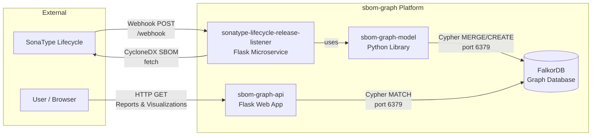
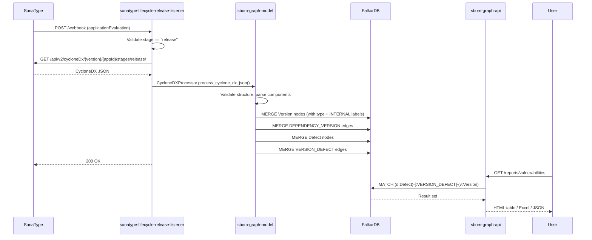
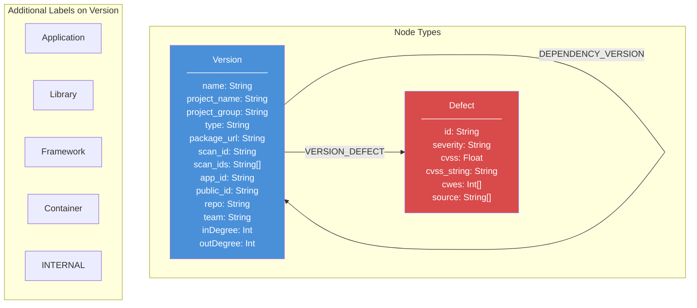
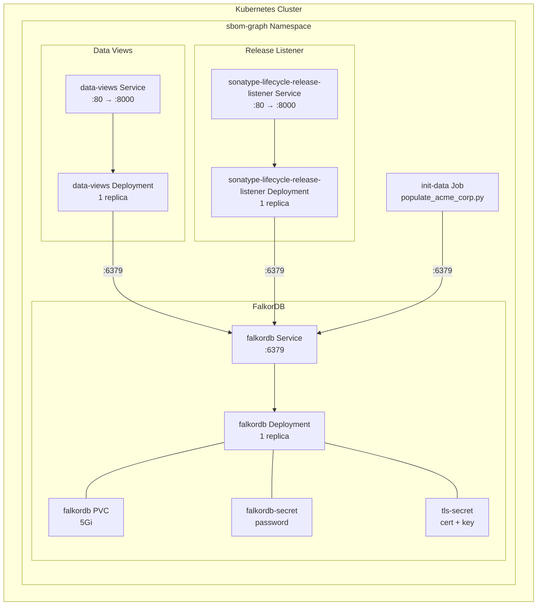

# SBOM Graph Platform Specification

## 1. Overview

SBOM Graph is an AppSec dependency analysis platform that ingests CycloneDX Software Bill of Materials (SBOM) files, stores the dependency graph in FalkorDB, and provides reports and interactive visualizations for vulnerability impact analysis, dependency hygiene auditing, and library centrality insights.

The platform detects bad practices such as SNAPSHOT dependencies in production releases, circular dependencies, non-SemVer versioning, and diamond dependency conflicts. During zero-day scenarios it enables rapid identification of all affected projects and their transitive dependants.

### Key Capabilities

- **Vulnerability Impact Analysis** -- Identifies which projects are affected by a vulnerability and determines fix ordering based on dependency depth (partition levels).
- **Dependency Hygiene** -- Detects SNAPSHOT usage, self-dependencies, non-SemVer versions, and circular dependency chains.
- **Library Centrality** -- Measures inDegree (popularity) and outDegree (complexity) for internal libraries.
- **Interactive Visualizations** -- K-partite, bipartite, and multi-layout dependency/dependant graphs with cycle highlighting.
- **Multi-Format Exports** -- HTML tables, Excel spreadsheets, and JSON with documented schemas for every report.

## 2. Architecture

### 2.1 System Architecture Diagram



### 2.2 Data Flow Diagram



## 3. Components

### 3.1 sbom-graph-model

A standalone Python library providing domain objects, CycloneDX parsing, and FalkorDB persistence.

**Package:** `sbom_graph_model`
**Build system:** hatchling (distributed as a wheel)

#### 3.1.1 Domain Model (`model.py`)

| Class | Type | Description |
|-------|------|-------------|
| `Project` | Node | Software project with name, group, type, purl, repo URL, team |
| `Version` | Node | Specific version of a project, linked to its `Project` |
| `Defect` | Node | Security vulnerability with id, severity, CVSS, CWEs, source |
| `License` | Node | Software license identifier |
| `DependencyVersion` | Edge | Parent version depends on child version |
| `VersionDefect` | Edge | Version is affected by a defect, with risk_status |
| `HasVersion` | Edge | Project has a version |

**Enums:**

| Enum | Values |
|------|--------|
| `ProjectType` | `Application (0)`, `Library (1)` |
| `DefectType` | `SAST (0)`, `SCA (1)` |
| `RiskStatus` | `ACCEPTED (2)`, `MITIGATED (1)`, `UNKNOWN (0)` |

#### 3.1.2 Persistence Layer (`persistence.py`)

The `Persistence` class manages all write operations to FalkorDB using parameterized Cypher queries.

**Constructor parameters:**

| Parameter | Type | Description |
|-----------|------|-------------|
| `host` | `str` | FalkorDB hostname |
| `port` | `int` | FalkorDB port (default 6379) |
| `graph_name` | `str` | Graph name in FalkorDB |
| `password` | `str` | FalkorDB password |
| `ssl` | `bool` | Enable TLS (default True) |
| `ssl_ca_certs` | `str` | Path to CA certificate bundle |
| `internal_prefixes` | `list[tuple[str, str]]` | Prefix rules for INTERNAL labeling |

**Internal prefix configuration:**

The `INTERNAL_PREFIXES` environment variable uses the format `field:prefix,field:prefix,...` where `field` is one of `group`, `name`, or `purl`. The static method `Persistence.parse_internal_prefixes()` parses this string into validated tuples. The `is_internal()` method checks whether a project matches any configured prefix.

**Write operations:**

| Method | Description |
|--------|-------------|
| `create_project_version(version)` | MERGE a Version node with type label and optional INTERNAL label |
| `create_defect(defect)` | MERGE a Defect node |
| `create_dependency(parent, child)` | MERGE a DEPENDENCY_VERSION edge between two Version nodes |
| `create_version_defect(version_defect)` | MERGE a VERSION_DEFECT edge between a Version and Defect |
| `create_indexes()` | Create indexes on Version.project_name, Version.project_group, Version.name, Defect.id |
| `add_inward_centrality_scores()` | Compute and store inDegree on INTERNAL nodes |
| `add_outward_centrality_scores()` | Compute and store outDegree on INTERNAL nodes |

**Cypher injection prevention:**

- Node labels are validated against `ALLOWED_PROJECT_TYPES` (a frozen set of CycloneDX 1.6 component types) and checked with a safe-identifier regex before string interpolation.
- All property values use Cypher parameterized queries (`$param`).
- The INTERNAL label is a hardcoded literal selected by boolean logic.

#### 3.1.3 CycloneDX Processor (`cyclonedx/processor.py`)

`CycloneDXProcessor` parses CycloneDX JSON and persists the extracted graph.

**Entry point:** `process_cyclone_dx_json(app_id, public_app_id, gitlab_project_url, json_data)`

**Processing steps:**

1. Validate CycloneDX structure (metadata, components, dependencies, vulnerabilities).
2. Parse the root application from `metadata.component`.
3. Parse all components into `(Project, Version)` tuples keyed by `bom-ref`.
4. Parse dependency relationships from the `dependencies` array.
5. Detect unlinked libraries and attach them to the root application.
6. Persist all Version nodes, DEPENDENCY_VERSION edges, Defect nodes, and VERSION_DEFECT edges.

### 3.2 sonatype-lifecycle-release-listener

A Flask microservice that receives SonaType webhook events and triggers SBOM ingestion.

**Port:** 5000 (development) / 8000 (production via gunicorn)
**WSGI server:** gunicorn with distroless container image

#### 3.2.1 Endpoints

| Method | Path | Description |
|--------|------|-------------|
| `GET` | `/health` | Health check (returns `{"status": "healthy"}`) |
| `POST` | `/webhook` | Receives SonaType webhook payloads |

#### 3.2.2 Webhook Processing Flow

1. Parse JSON payload; reject if missing or malformed.
2. Extract `applicationEvaluation`; ignore messages without it.
3. Verify `stage == "release"` (case-insensitive); ignore non-release stages.
4. Extract `application.id` and `application.publicId`.
5. Instantiate `CycloneHelper` which creates a `Persistence` instance with parsed `INTERNAL_PREFIXES`.
6. Fetch CycloneDX SBOM from SonaType API via `SonaTypeClient`.
7. Process SBOM through `CycloneDXProcessor.process_cyclone_dx_json()`.

#### 3.2.3 Configuration

| Variable | Required | Default | Description |
|----------|----------|---------|-------------|
| `SONATYPE_HOST` | Yes | -- | SonaType API hostname |
| `SONATYPE_USERNAME` | Yes | -- | SonaType API username |
| `SONATYPE_PASSWORD` | Yes | -- | SonaType API password |
| `SONATYPE_CACERTS` | No | `certs/ca_bundle.pem` | CA certificate path |
| `FALKORDB_HOST` | No | (empty) | FalkorDB hostname |
| `FALKORDB_PORT` | No | `6379` | FalkorDB port |
| `FALKORDB_GRAPH_NAME` | No | `acme-corp` | Graph name |
| `FALKORDB_PASSWORD` | No | (empty) | FalkorDB password |
| `FALKORDB_CACERTS` | No | `certs/ca_bundle.pem` | FalkorDB CA path |
| `INTERNAL_PREFIXES` | No | (empty) | `field:prefix,...` format |

### 3.3 sbom-graph-api

A Flask web application providing reports, graph visualizations, and JSON/Excel exports over the FalkorDB dependency graph.

**Port:** 8080 (development) / 8000 (production via gunicorn)
**WSGI server:** gunicorn with distroless container image

#### 3.3.1 Service Layer

`FalkorDBService` (`services/falkordb_service.py`) encapsulates all read queries against FalkorDB. It uses iterative breadth-first traversal for transitive queries to handle cycles and FalkorDB's entity-match limits.

**Key design decisions:**

- Transitive queries use BFS one-depth-at-a-time to avoid FalkorDB's 10,000 entity match limit.
- Cycles are removed using DFS-based back-edge removal (O(V+E)), not `nx.simple_cycles()` which has exponential worst-case complexity.
- Visualizations skip scan_id filtering (`skip_scan_filter=True`) to show raw graph structure; reports use scan_id intersection for accuracy.

#### 3.3.2 Authentication

Authentication is optional, controlled by `AUTH_ENABLED` environment variable.

| Method | Description |
|--------|-------------|
| **LDAP** | Bind authentication with group-based authorization (admin/user groups) |
| **Local users** | SQLite-backed user storage with PBKDF2-SHA256 password hashing (600,000 iterations) |
| **JWT tokens** | API token management with encrypted SQLite storage (Fernet) |

When enabled, all endpoints except `/health` and `/ready` require authentication via session cookie or `Authorization: Bearer <token>` header.

#### 3.3.3 Configuration

The `AppConfig` dataclass loads all configuration from environment variables:

| Subsystem | Key Variables |
|-----------|---------------|
| **App** | `FLASK_DEBUG`, `FLASK_HOST`, `FLASK_PORT`, `FLASK_SECRET_KEY`, `AUTH_ENABLED` |
| **FalkorDB** | `FALKORDB_HOST`, `FALKORDB_PORT`, `FALKORDB_PASSWORD`, `FALKORDB_GRAPH_NAME`, `FALKORDB_INTERNAL_LABEL` |
| **TLS** | `TLS_ENABLED`, `TLS_CERT_FILE`, `TLS_KEY_FILE`, `TLS_CA_FILE` |
| **JWT** | `JWT_SECRET_KEY`, `JWT_ACCESS_TOKEN_EXPIRES_HOURS`, `JWT_REFRESH_TOKEN_EXPIRES_DAYS`, `JWT_ALGORITHM` |
| **LDAP** | `LDAP_ENABLED`, `LDAP_SERVER`, `LDAP_PORT`, `LDAP_BASE_DN`, `LDAP_ADMIN_GROUPS`, `LDAP_USER_GROUPS` |
| **Token DB** | `TOKEN_DB_PATH`, `TOKEN_DB_ENCRYPTION_KEY` |

### 3.4 Umbrella Helm Chart

Located at `helm/sbom-graph/`, this chart deploys the full platform into Kubernetes.

**Chart name:** `sbom-graph`
**Chart version:** `0.1.0`

#### 3.4.1 Deployed Resources

| Template | Resource | Description |
|----------|----------|-------------|
| `falkordb-deployment.yaml` | Deployment | FalkorDB server with optional TLS init container |
| `falkordb-service.yaml` | Service | ClusterIP service on port 6379 |
| `falkordb-pvc.yaml` | PersistentVolumeClaim | Persistent storage (default 5Gi) |
| `falkordb-secret.yaml` | Secret | FalkorDB password |
| `tls-secret.yaml` | Secret | TLS certificate and key |
| `data-views-deployment.yaml` | Deployment | sbom-graph-api application |
| `data-views-service.yaml` | Service | ClusterIP service for data-views |
| `sonatype-lifecycle-release-listener-deployment.yaml` | Deployment | sonatype-lifecycle-release-listener microservice |
| `sonatype-lifecycle-release-listener-service.yaml` | Service | ClusterIP service for sonatype-lifecycle-release-listener |
| `init-data-job.yaml` | Job | Preloads demo data from `scripts/populate_acme_corp.py` |

#### 3.4.2 Key Helm Values

```yaml
global:
  internalPrefixes: "group:com.acme,name:acme-"

falkordb:
  image: { repository: falkordb/falkordb, tag: latest }
  password: ""
  persistence: { enabled: true, size: 5Gi }
  tls: { enabled: true, key: "", cert: "" }

dataViews:
  image: { repository: sbom-graph-api, tag: latest }
  replicas: 1

releaseListener:
  image: { repository: sonatype-lifecycle-release-listener, tag: latest }
  replicas: 1

initData:
  enabled: true

graphName: "acme-corp"
```

When `falkordb.tls.enabled` is true and `key`/`cert` are empty, an init container generates self-signed certificates.

## 4. Graph Database Schema

### 4.1 Schema Diagram



### 4.2 Node Details

#### Version Node

Primary label: `Version`. Additional labels are applied based on CycloneDX component type and internal prefix matching.

| Label | Applied When |
|-------|-------------|
| `Application` | `type == "application"` |
| `Library` | `type == "library"` |
| `Framework` | `type == "framework"` |
| `Container` | `type == "container"` |
| `INTERNAL` | Project matches any configured internal prefix |

**MERGE key:** `(name, project_name, project_group)` -- these three properties uniquely identify a Version node.

#### Defect Node

**MERGE key:** `(id)` -- the vulnerability identifier (e.g., CVE-2021-44228).

### 4.3 Relationships

| Relationship | From | To | Properties | Description |
|-------------|------|-----|------------|-------------|
| `DEPENDENCY_VERSION` | Version | Version | -- | Parent version depends on child version |
| `VERSION_DEFECT` | Version | Defect | -- | Version is affected by a vulnerability |

### 4.4 Indexes

| Label | Property | Purpose |
|-------|----------|---------|
| `Version` | `project_name` | Fast project lookup |
| `Version` | `project_group` | Fast group-based disambiguation |
| `Version` | `name` | Fast version lookup |
| `Defect` | `id` | Fast vulnerability lookup |

## 5. API Reference

### 5.1 Reports (`/reports`)

All report endpoints support the `format` query parameter (`html`, `excel`, `json`) and return `@auth_required`-protected responses.

#### Global Query Parameters

| Parameter | Type | Default | Description |
|-----------|------|---------|-------------|
| `format` | `string` | `html` | Output format: `html`, `excel`, or `json` |
| `internal_only` | `boolean` | `false` | Filter to INTERNAL-labeled nodes only |
| `project_group` | `string` | -- | Optional group for project disambiguation |

#### Report Endpoints

| Method | Path | Extra Parameters | Description |
|--------|------|------------------|-------------|
| `GET` | `/reports/projects` | `limit` | All projects with versions |
| `GET` | `/reports/applications` | `limit`, `latest_only` | All application nodes with metadata |
| `GET` | `/reports/snapshots` | -- | Applications with SNAPSHOT dependencies |
| `GET` | `/reports/self-dependencies` | -- | Nodes that depend on themselves (cycles) |
| `GET` | `/reports/multi-version-deps/{project_name}` | -- | All versions of a library and their dependants |
| `GET` | `/reports/multi-version-sources/{project_name}/{version_name}` | `max_depth` | Diamond dependency conflict analysis |
| `GET` | `/reports/version-dependencies/{project_name}/{version_name}` | `max_depth` | Transitive dependencies (supports `latest`) |
| `GET` | `/reports/dependants/{project_name}/{version_name}` | `max_depth`, `longest_only` | Transitive dependants with partitions and paths |
| `GET` | `/reports/vulnerabilities` | -- | All vulnerabilities ordered by severity |
| `GET` | `/reports/vulnerability-dependants/{defect_id}` | `max_depth` | Projects affected by a specific vulnerability |
| `GET` | `/reports/centrality` | `sort_by`, `sort_order`, `limit` | inDegree/outDegree for internal libraries |
| `GET` | `/reports/non-semver-versions` | -- | Versions not following SemVer convention |

#### PURL Variant Routes

Package URL (purl) can be used as an alternative to `project_name` path parameters. These routes resolve the purl to coordinates and redirect (307) to the canonical endpoint.

| PURL Route | Canonical Redirect |
|------------|-------------------|
| `/reports/multi-version-deps/purl/{purl}` | `/reports/multi-version-deps/{project_name}` |
| `/reports/multi-version-sources/purl/{purl}` | `/reports/multi-version-sources/{project_name}/{version}` |
| `/reports/version-dependencies/purl/{purl}` | `/reports/version-dependencies/{project_name}/{version}` |
| `/reports/dependants/purl/{purl}` | `/reports/dependants/{project_name}/{version}` |

### 5.2 Visualizations (`/visualizations`)

All visualization endpoints return self-contained HTML pages with inline JavaScript (PyVis).

#### Visualization Query Parameters

| Parameter | Type | Default | Description |
|-----------|------|---------|-------------|
| `max_depth` | `int` | `50` | Maximum traversal depth (1-100) |
| `internal_only` | `boolean` | `false` | Filter to INTERNAL-labeled nodes |
| `project_group` | `string` | -- | Optional group for disambiguation |
| `layout` | `string` | varies | Layout algorithm (multi-layout endpoints only) |
| `height` | `string` | `100vh` | CSS dimension for canvas height |
| `width` | `string` | `100vw` | CSS dimension for canvas width |

#### Layout Algorithms (dependencies / dependants-multi)

| Layout | Description |
|--------|-------------|
| `spring` | Force-directed (ForceAtlas2) -- best for cyclic graphs (default for dependencies) |
| `radial` | Radial tree with concentric circles (default for dependants-multi) |
| `shell` | Nodes grouped in shells by depth level |
| `bfs` | BFS tree -- traditional hierarchical layout |
| `circular` | Nodes arranged in a circle |

#### Visualization Endpoints

| Method | Path | Description |
|--------|------|-------------|
| `GET` | `/visualizations/kpartite/{project_name}/{version}` | K-partite hierarchical dependency graph |
| `GET` | `/visualizations/bipartite/{project_name}` | Two-column version/dependant graph |
| `GET` | `/visualizations/dependants/{project_name}/{version}` | Full reverse dependency tree (hierarchical) |
| `GET` | `/visualizations/dependencies/{project_name}/{version}` | Forward dependency graph with layout switcher |
| `GET` | `/visualizations/dependants-multi/{project_name}/{version}` | Reverse dependency graph with layout switcher |

All visualization endpoints also have `/purl/<path:purl>` variants.

### 5.3 Authentication (`/auth`)

Available when `AUTH_ENABLED=true`.

| Method | Path | Description |
|--------|------|-------------|
| `GET/POST` | `/auth/login` | Login page and credential submission |
| `GET` | `/auth/logout` | Clear session |
| `POST` | `/auth/refresh` | Refresh JWT access token |
| `GET/POST` | `/auth/change-password` | Change password (local auth) |
| `GET` | `/auth/tokens` | List user's API tokens |
| `GET/POST` | `/auth/tokens/create` | Create new API token |
| `POST` | `/auth/tokens/{id}/revoke` | Revoke a token |
| `GET` | `/auth/status` | Check authentication status |

#### Admin Endpoints (local auth only)

| Method | Path | Description |
|--------|------|-------------|
| `GET` | `/auth/admin/users` | User management page |
| `GET/POST` | `/auth/admin/users/create` | Create new user |
| `POST` | `/auth/admin/users/{username}/toggle-admin` | Toggle admin role |
| `POST` | `/auth/admin/users/{username}/toggle-active` | Enable/disable user |
| `POST` | `/auth/admin/users/{username}/reset-password` | Reset password |
| `POST` | `/auth/admin/users/{username}/delete` | Delete user |

### 5.4 Schemas (`/schemas`)

| Method | Path | Description |
|--------|------|-------------|
| `GET` | `/schemas/` | List all available JSON schemas |
| `GET` | `/schemas/{schema_name}` | Get a specific schema (Draft-07) |

### 5.5 Health Endpoints

| Method | Path | Service | Description |
|--------|------|---------|-------------|
| `GET` | `/health` | both | Liveness probe |
| `GET` | `/ready` | sbom-graph-api | Readiness probe (verifies FalkorDB connection) |

## 6. Configuration

### 6.1 Environment Variables Summary

#### Shared (FalkorDB Connection)

| Variable | Default | Components |
|----------|---------|------------|
| `FALKORDB_HOST` | `localhost` | all |
| `FALKORDB_PORT` | `6379` | all |
| `FALKORDB_PASSWORD` | (empty) | all |
| `FALKORDB_GRAPH_NAME` | `acme-corp` / `acme_corp` | all |
| `INTERNAL_PREFIXES` | (empty) | sonatype-lifecycle-release-listener, sbom-graph-model |
| `FALKORDB_INTERNAL_LABEL` | `INTERNAL` | sbom-graph-api |

#### sonatype-lifecycle-release-listener

| Variable | Default | Description |
|----------|---------|-------------|
| `SONATYPE_HOST` | (required) | SonaType API hostname |
| `SONATYPE_USERNAME` | (required) | API username |
| `SONATYPE_PASSWORD` | (required) | API password |
| `SONATYPE_CACERTS` | `certs/ca_bundle.pem` | CA bundle path |

#### sbom-graph-api

| Variable | Default | Description |
|----------|---------|-------------|
| `AUTH_ENABLED` | `false` | Enable authentication |
| `FLASK_SECRET_KEY` | dev default | Flask session secret |
| `JWT_SECRET_KEY` | dev default | JWT signing secret |
| `JWT_ALGORITHM` | `HS256` | JWT algorithm |
| `LDAP_ENABLED` | `false` | Enable LDAP auth backend |
| `LDAP_SERVER` | `localhost` | LDAP server hostname |
| `LDAP_ADMIN_GROUPS` | (empty) | Comma-separated admin group CNs |
| `LDAP_USER_GROUPS` | (empty) | Comma-separated user group CNs |
| `TLS_ENABLED` | `false` | Enable HTTPS |
| `TOKEN_DB_PATH` | `/data/tokens.db` | SQLite token database path |
| `TOKEN_DB_ENCRYPTION_KEY` | dev default | Fernet encryption key for tokens |

## 7. Deployment

### 7.1 Deployment Diagram



### 7.2 Docker Builds

All images are built from the repository root because Dockerfiles reference sibling directories.

```bash
./build-images.sh              # Build all (model wheel + both images)
./build-images.sh model        # Build sbom-graph-model wheel only
./build-images.sh sbom-graph-api   # Build data-views image
./build-images.sh sonatype-lifecycle-release-listener    # Build sonatype-lifecycle-release-listener image (auto-builds wheel)
```

**Image details:**

| Image | Base | User | Notes |
|-------|------|------|-------|
| `sbom-graph-api` | `gcr.io/distroless/python3-debian12:nonroot` | UID 65532 | Read-only root FS, no shell |
| `sonatype-lifecycle-release-listener` | `gcr.io/distroless/python3-debian12:nonroot` | UID 65532 | Read-only root FS, no shell |

### 7.3 Helm Deployment

```bash
# Deploy full platform
helm install sbom-graph ./helm/sbom-graph

# With custom internal prefixes
helm install sbom-graph ./helm/sbom-graph \
  --set global.internalPrefixes="group:com.myorg,name:myorg-"

# Disable demo data preloading
helm install sbom-graph ./helm/sbom-graph \
  --set initData.enabled=false
```

### 7.4 Build Dependencies

```
sbom-graph-model (wheel)
    ├── sonatype-lifecycle-release-listener (COPY wheel into Docker image)
    └── sbom-graph-api (independent, queries FalkorDB directly)
```

The `sonatype-lifecycle-release-listener` Dockerfile copies the pre-built `sbom-graph-model` wheel and installs it with pip. The `sbom-graph-api` application does not depend on `sbom-graph-model`; it queries FalkorDB directly through its own `FalkorDBService`.

## 8. Security

### 8.1 Cypher Injection Prevention

- All Cypher queries use parameterized values (`$param`) for user-supplied data.
- Node labels interpolated into queries are validated against `ALLOWED_PROJECT_TYPES` (a hardcoded frozenset) and checked with `_SAFE_IDENTIFIER_RE` regex.
- The INTERNAL label is a boolean-selected literal, never derived from external input.

### 8.2 Input Validation

`sbom-graph-api` validates all user inputs through `utils/validation.py`:

| Function | Purpose |
|----------|---------|
| `validate_project_name()` | Sanitize project name path parameters |
| `validate_version_name()` | Sanitize version string path parameters |
| `validate_defect_id()` | Sanitize vulnerability ID parameters |
| `validate_format()` | Restrict to `html`, `excel`, `json` |
| `validate_boolean()` | Strict boolean parsing |
| `validate_max_depth()` | Enforce 1-100 range |
| `validate_limit()` | Enforce maximum result count |
| `validate_css_dimension()` | Allowlist CSS dimension patterns |
| `validate_layout()` | Restrict to known layout algorithms |
| `validate_project_group()` | Sanitize group parameter |

### 8.3 Authentication Security

- Passwords hashed with PBKDF2-SHA256 using 600,000 iterations and random salt.
- JWT tokens signed with HS256 (configurable) using explicit algorithm specification.
- Token values are SHA-256 hashed for lookup and Fernet-encrypted at rest in SQLite.
- LDAP authentication uses bind operations (not filter-based authentication).
- Session cookies are HTTP-only and secure (HTTPS-only) when TLS is enabled.

### 8.4 Container Security

- Distroless base images with no shell access.
- Non-root user (UID 65532).
- Read-only root filesystem with explicit writable mounts (`/tmp`, `/app/data`).
- Resource limits enforced via Kubernetes.

### 8.5 Sensitive Configuration

- FalkorDB password stored in Kubernetes Secret.
- TLS certificates stored in Kubernetes Secret.
- SonaType credentials via Kubernetes Secret or `existingSecret` reference.
- JWT and Flask secret keys loaded from environment variables (not hardcoded).
- Default development values exist for local testing but must be overridden in production.

## License

MIT
