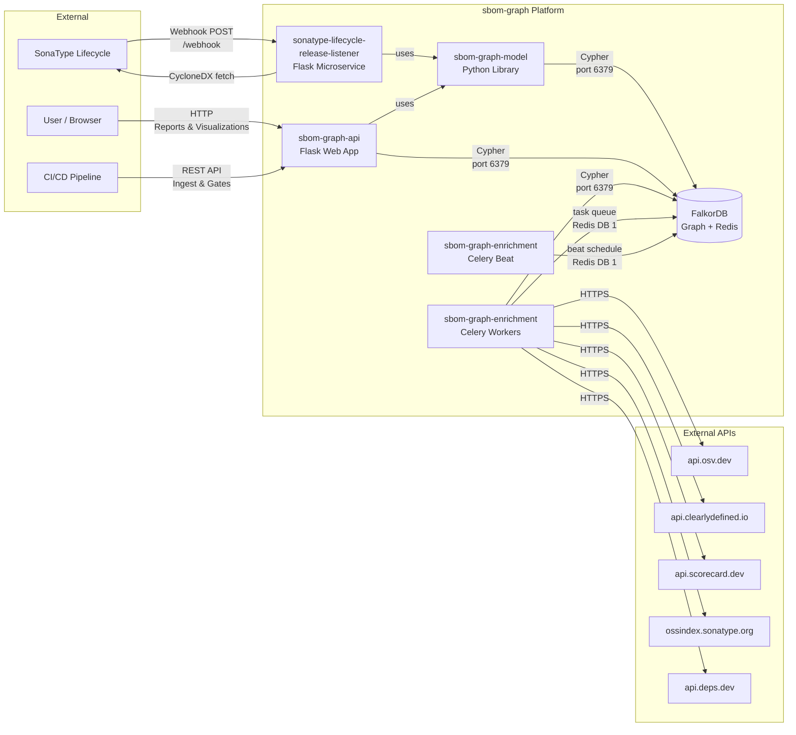
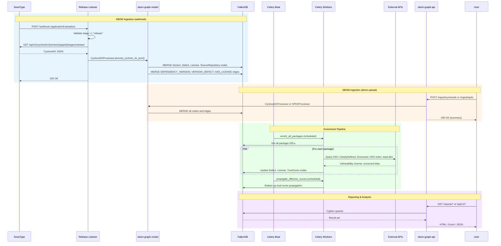
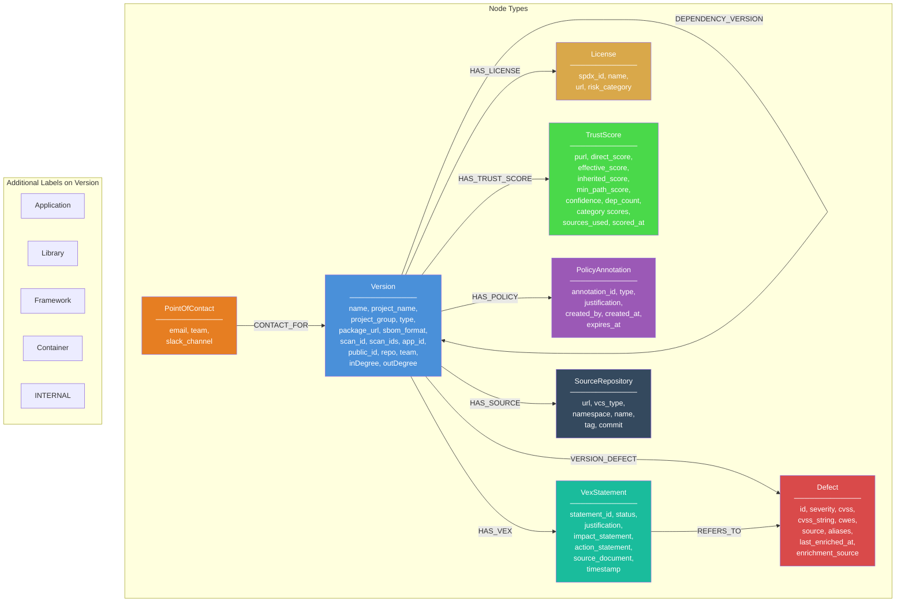
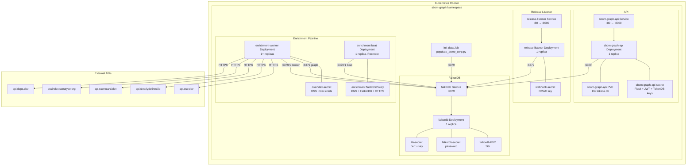

# SBOM Graph Platform Specification

## 1. Overview

SBOM Graph is a supply-chain security platform that ingests CycloneDX and SPDX Software Bill of Materials (SBOM) files, stores the dependency graph in FalkorDB, enriches packages with vulnerability, license, and trust score data via a Celery-based pipeline, and provides reports, programmatic APIs, and interactive visualizations for vulnerability impact analysis, dependency hygiene auditing, incident response, and policy enforcement.

The platform detects bad practices such as SNAPSHOT dependencies in production releases, circular dependencies, non-SemVer versioning, and diamond dependency conflicts. During zero-day scenarios it enables rapid identification of all affected projects and their transitive dependants through frontier-level patch planning and blast radius analysis. VEX (Vulnerability Exploitability eXchange) statements provide triage context for vulnerability management.

### Key Capabilities

- **SBOM Ingestion** -- Accepts CycloneDX 1.6 and SPDX 2.3 SBOMs via direct upload or SonaType Lifecycle webhook integration, with automatic format detection.
- **Vulnerability Enrichment** -- Continuously enriches packages with vulnerability data from OSV, Sonatype OSS Index, and deps.dev via Celery workers.
- **License Tracking** -- Extracts licenses from SBOMs and enriches via ClearlyDefined; detects license conflicts across transitive dependency trees.
- **Supply-Chain Trust Score** -- Computes and propagates 0-10 trust scores from OpenSSF Scorecard, OSV, OSS Index, and deps.dev, with bottom-up graph propagation.
- **VEX Support** -- Ingests OpenVEX documents to annotate vulnerabilities with triage status (not_affected, affected, fixed, under_investigation).
- **Policy Annotations** -- CertifyBad/CertifyGood/Hold annotations on packages for organisational governance and CI/CD gates.
- **Patch Planning & Blast Radius** -- Frontier-level incident response: given a CVE, compute the fix ordering and contact chain; given a package, compute the blast radius.
- **Dependency Hygiene** -- Detects SNAPSHOT usage, self-dependencies, non-SemVer versions, and circular dependency chains.
- **Library Centrality** -- Measures inDegree (popularity) and outDegree (complexity) for internal libraries.
- **Source Repository Tracking** -- Links packages to their source repositories for provenance analysis.
- **Interactive Visualizations** -- K-partite, bipartite, and multi-layout dependency/dependant graphs with cycle highlighting and severity colour-coding.
- **Multi-Format Exports** -- HTML tables, Excel spreadsheets, and JSON with documented schemas for every report.
- **CI/CD Gates** -- Programmatic API endpoints for trust score checks and policy enforcement in build pipelines.

## 2. Architecture

### 2.1 System Architecture Diagram



### 2.2 Data Flow Diagram



## 3. Components

### 3.1 sbom-graph-model

A standalone Python library providing domain objects, CycloneDX and SPDX parsing, OpenVEX processing, and FalkorDB persistence.

**Package:** `sbom_graph_model`
**Version:** 0.1.0
**Build system:** hatchling (distributed as a wheel)

#### 3.1.1 Domain Model (`model.py`)

**Node classes:**

| Class | Type | Description |
|-------|------|-------------|
| `Project` | Node | Software project with name, group, type, purl, repo URL, team, licenses |
| `Version` | Node | Specific version of a project with sbom_format tracking |
| `Defect` | Node | Security vulnerability with id, severity, CVSS, CWEs, source, enrichment metadata |
| `License` | Node | Software license with spdx_id, name, url, risk_category |
| `TrustScore` | Node | Composite trust score with category breakdowns, propagated scores, and confidence |
| `PolicyAnnotation` | Node | Governance annotation (bad/good/hold) with justification and expiry |
| `PointOfContact` | Node | Incident response contact with email, team, slack_channel |
| `VexStatement` | Node | VEX triage statement with status, justification, impact/action statements |
| `SourceRepository` | Node | Source code repository with URL, VCS type, namespace, name, tag, commit |

**Edge classes:**

| Class | Relationship | From | To | Description |
|-------|-------------|------|-----|-------------|
| `DependencyVersion` | `DEPENDENCY_VERSION` | Version | Version | Parent depends on child |
| `VersionDefect` | `VERSION_DEFECT` | Version | Defect | Version affected by vulnerability |
| `VersionLicense` | `HAS_LICENSE` | Version | License | Version uses license |
| `HasTrustScore` | `HAS_TRUST_SCORE` | Version | TrustScore | Version has trust score |
| `VersionPolicy` | `HAS_POLICY` | Version | PolicyAnnotation | Version has policy annotation |
| `ContactFor` | `CONTACT_FOR` | PointOfContact | Version | Contact responsible for version |
| `VersionVex` | `HAS_VEX` | Version | VexStatement | Version has VEX statement |
| `VexRefersTo` | `REFERS_TO` | VexStatement | Defect | VEX statement refers to vulnerability |
| `VersionSource` | `HAS_SOURCE` | Version | SourceRepository | Version linked to source repo |
| `HasVersion` | `HAS_VERSION` | Project | Version | Project has version |

**Enums:**

| Enum | Values |
|------|--------|
| `ProjectType` | `Application (0)`, `Library (1)` |
| `DefectType` | `SAST (0)`, `SCA (1)` |
| `RiskStatus` | `ACCEPTED (2)`, `MITIGATED (1)`, `UNKNOWN (0)` |
| `PolicyType` | `BAD`, `GOOD`, `HOLD` (with `from_str()` factory) |
| `VexStatus` | `not_affected`, `affected`, `fixed`, `under_investigation` |
| `LicenseRiskCategory` | `permissive`, `weak_copyleft`, `strong_copyleft`, `proprietary`, `unknown` |

#### 3.1.2 Persistence Layer (`persistence.py`)

The `Persistence` class manages all write operations to FalkorDB using parameterized Cypher queries.

**Constructor parameters:**

| Parameter | Type | Description |
|-----------|------|-------------|
| `host` | `str` | FalkorDB hostname |
| `port` | `int` | FalkorDB port (default 6379) |
| `graph_name` | `str` | Graph name in FalkorDB |
| `password` | `str` | FalkorDB password |
| `ssl` | `bool` | Enable TLS (default True) |
| `ssl_ca_certs` | `str` | Path to CA certificate bundle |
| `internal_prefixes` | `list[tuple[str, str]]` | Prefix rules for INTERNAL labeling |

**Internal prefix configuration:**

The `INTERNAL_PREFIXES` environment variable uses the format `field:prefix,field:prefix,...` where `field` is one of `group`, `name`, or `purl`. The static method `Persistence.parse_internal_prefixes()` parses this string into validated tuples. The `is_internal()` method checks whether a project matches any configured prefix.

**Write operations:**

| Method | Description |
|--------|-------------|
| `create_project_version(version)` | MERGE a Version node with type label and optional INTERNAL label |
| `create_defect(defect)` | MERGE a Defect node |
| `create_dependency(parent, child)` | MERGE a DEPENDENCY_VERSION edge between two Version nodes |
| `create_version_defect(version_defect)` | MERGE a VERSION_DEFECT edge between a Version and Defect |
| `create_license(license)` | MERGE a License node (keyed on spdx_id) |
| `create_version_license(version, license)` | MERGE a HAS_LICENSE edge (by purl) |
| `create_version_license_by_name(...)` | MERGE a HAS_LICENSE edge (by project_name/version_name) |
| `create_trust_score(trust_score)` | MERGE a TrustScore node (keyed on purl) |
| `link_version_to_trust_score(purl)` | MERGE a HAS_TRUST_SCORE edge |
| `update_trust_score_propagation(...)` | Update effective, inherited, min_path scores |
| `create_policy_annotation(annotation)` | MERGE a PolicyAnnotation node |
| `link_policy_to_version(annotation, version)` | MERGE a HAS_POLICY edge |
| `delete_policy_annotation(annotation_id)` | DETACH DELETE a PolicyAnnotation |
| `create_point_of_contact(poc)` | MERGE a PointOfContact node |
| `link_contact_to_version(poc, version)` | MERGE a CONTACT_FOR edge |
| `create_vex_statement(vex)` | MERGE a VexStatement node |
| `link_vex_to_version(vex, version)` | MERGE a HAS_VEX edge |
| `link_vex_to_defect(vex, defect)` | MERGE a REFERS_TO edge |
| `create_source_repository(repo)` | MERGE a SourceRepository node |
| `link_version_to_source(purl, repo_url)` | MERGE a HAS_SOURCE edge (by purl) |
| `link_version_to_source_by_name(...)` | MERGE a HAS_SOURCE edge (by name) |
| `update_defect_enrichment(...)` | Update enrichment metadata on Defect |
| `get_versions_by_purl(purl)` | Retrieve versions matching a package URL |
| `get_packages_needing_enrichment(...)` | Return purls where enrichment is stale or missing |
| `get_all_trust_scores()` | Retrieve all TrustScore nodes |
| `get_dependency_graph_for_propagation()` | Return adjacency list for trust score propagation |
| `create_indexes()` | Create all indexes (see Section 4.4) |
| `add_inward_centrality_scores()` | Compute and store inDegree on INTERNAL nodes |
| `add_outward_centrality_scores()` | Compute and store outDegree on INTERNAL nodes |

**Cypher injection prevention:**

- Node labels are validated against `ALLOWED_PROJECT_TYPES` (a frozen set of CycloneDX 1.6 component types: Application, Library, Framework, Container, Platform, Device, Firmware, File, Machine-Learning-Model, Data) and checked with a safe-identifier regex before string interpolation.
- All property values use Cypher parameterized queries (`$param`).
- The INTERNAL label is a hardcoded literal selected by boolean logic.

#### 3.1.3 CycloneDX Processor (`cyclonedx/processor.py`)

`CycloneDXProcessor` parses CycloneDX JSON and persists the extracted graph.

**Entry point:** `process_cyclone_dx_json(app_id, public_app_id, gitlab_project_url, json_data)`

**Processing steps:**

1. Validate CycloneDX structure (metadata, components, dependencies, vulnerabilities).
2. Parse the root application from `metadata.component`.
3. Parse all components into `(Project, Version)` tuples keyed by `bom-ref`.
4. Parse dependency relationships from the `dependencies` array.
5. Extract `component.licenses[]` and create License nodes and HAS_LICENSE edges.
6. Extract source repository information from `component.externalReferences`.
7. Detect unlinked libraries and attach them to the root application.
8. Persist all Version nodes, DEPENDENCY_VERSION edges, Defect nodes, VERSION_DEFECT edges, License nodes, HAS_LICENSE edges, and SourceRepository nodes.

#### 3.1.4 SPDX Processor (`spdx/processor.py`)

`SPDXProcessor` parses SPDX 2.3 JSON documents and persists the extracted graph.

**Processing steps:**

1. Parse SPDX `packages[]` into Version nodes.
2. Parse `relationships[]` into DEPENDENCY_VERSION edges (mapping SPDX relationship types to dependency semantics).
3. Extract `licenseConcluded` and `licenseDeclared` fields into License nodes and HAS_LICENSE edges.
4. Extract `externalRefs` for source repository linking.
5. Parse `vulnerabilities[]` (if present) into Defect nodes.

#### 3.1.5 VEX Processor (`vex.py`)

`VexProcessor` parses OpenVEX JSON documents and links VEX statements to existing graph data.

**Processing steps:**

1. Parse OpenVEX document structure.
2. Map VEX statements to `VexStatement` nodes.
3. Link to existing `Defect` nodes via vulnerability ID matching.
4. Link to existing `Version` nodes via purl matching.

### 3.2 sonatype-lifecycle-release-listener

A Flask microservice that receives SonaType webhook events and triggers SBOM ingestion.

**Port:** 5000 (development) / 8000 (production via gunicorn)
**WSGI server:** gunicorn with distroless container image

#### 3.2.1 Endpoints

| Method | Path | Description |
|--------|------|-------------|
| `GET` | `/health` | Health check (returns `{"status": "healthy"}`) |
| `POST` | `/webhook` | Receives SonaType webhook payloads |

#### 3.2.2 Webhook Processing Flow

1. Parse JSON payload; reject if missing or malformed.
2. Extract `applicationEvaluation`; ignore messages without it.
3. Verify `stage == "release"` (case-insensitive); ignore non-release stages.
4. Extract `application.id` and `application.publicId`.
5. Instantiate `CycloneHelper` which creates a `Persistence` instance with parsed `INTERNAL_PREFIXES`.
6. Fetch CycloneDX SBOM from SonaType API via `SonaTypeClient`.
7. Process SBOM through `CycloneDXProcessor.process_cyclone_dx_json()`.

#### 3.2.3 Configuration

| Variable | Required | Default | Description |
|----------|----------|---------|-------------|
| `SONATYPE_HOST` | Yes | -- | SonaType API hostname |
| `SONATYPE_USERNAME` | Yes | -- | SonaType API username |
| `SONATYPE_PASSWORD` | Yes | -- | SonaType API password |
| `SONATYPE_CACERTS` | No | `certs/ca_bundle.pem` | CA certificate path |
| `FALKORDB_HOST` | No | (empty) | FalkorDB hostname |
| `FALKORDB_PORT` | No | `6379` | FalkorDB port |
| `FALKORDB_GRAPH_NAME` | No | `acme-corp` | Graph name |
| `FALKORDB_PASSWORD` | No | (empty) | FalkorDB password |
| `FALKORDB_CACERTS` | No | `certs/ca_bundle.pem` | FalkorDB CA path |
| `INTERNAL_PREFIXES` | No | (empty) | `field:prefix,...` format |

### 3.3 sbom-graph-api

A Flask web application providing reports, graph visualizations, programmatic APIs, SBOM ingestion endpoints, and JSON/Excel exports over the FalkorDB dependency graph.

**Port:** 8080 (development) / 8000 (production via gunicorn)
**WSGI server:** gunicorn with distroless container image
**Depends on:** `sbom-graph-model` (for SBOM ingestion and VEX processing)

#### 3.3.1 Service Layer

`FalkorDBService` (`services/falkordb_service.py`) encapsulates all read queries against FalkorDB. It uses iterative breadth-first traversal for transitive queries to handle cycles and FalkorDB's entity-match limits.

**Key design decisions:**

- Transitive queries use BFS one-depth-at-a-time to avoid FalkorDB's 10,000 entity match limit.
- Cycles are removed using DFS-based back-edge removal (O(V+E)), not `nx.simple_cycles()` which has exponential worst-case complexity.
- Visualizations skip scan_id filtering (`skip_scan_filter=True`) to show raw graph structure; reports use scan_id intersection for accuracy.
- Patch plan computation uses frontier-level BFS starting from a Defect node through VERSION_DEFECT and reverse DEPENDENCY_VERSION edges.
- Trust score queries retrieve pre-computed scores stored by the enrichment pipeline.

#### 3.3.2 Authentication

Authentication is optional, controlled by `AUTH_ENABLED` environment variable.

| Method | Description |
|--------|-------------|
| **LDAP** | Bind authentication with group-based authorization (admin/user groups) |
| **Local users** | SQLite-backed user storage with PBKDF2-SHA256 password hashing (600,000 iterations) |
| **JWT tokens** | API token management with encrypted SQLite storage (Fernet) |

When enabled, all endpoints except `/health` and `/ready` require authentication via session cookie or `Authorization: Bearer <token>` header.

#### 3.3.3 Configuration

The `AppConfig` dataclass loads all configuration from environment variables:

| Subsystem | Key Variables |
|-----------|---------------|
| **App** | `FLASK_DEBUG`, `FLASK_HOST`, `FLASK_PORT`, `FLASK_SECRET_KEY`, `AUTH_ENABLED` |
| **FalkorDB** | `FALKORDB_HOST`, `FALKORDB_PORT`, `FALKORDB_PASSWORD`, `FALKORDB_GRAPH_NAME`, `FALKORDB_INTERNAL_LABEL` |
| **TLS** | `TLS_ENABLED`, `TLS_CERT_FILE`, `TLS_KEY_FILE`, `TLS_CA_FILE` |
| **JWT** | `JWT_SECRET_KEY`, `JWT_ACCESS_TOKEN_EXPIRES_HOURS`, `JWT_REFRESH_TOKEN_EXPIRES_DAYS`, `JWT_ALGORITHM` |
| **LDAP** | `LDAP_ENABLED`, `LDAP_SERVER`, `LDAP_PORT`, `LDAP_BASE_DN`, `LDAP_ADMIN_GROUPS`, `LDAP_USER_GROUPS` |
| **Token DB** | `TOKEN_DB_PATH`, `TOKEN_DB_ENCRYPTION_KEY` |

### 3.4 sbom-graph-enrichment

A Celery-based enrichment pipeline that continuously enriches packages with vulnerability, license, and trust score data from external APIs.

**Package:** `sbom_graph_enrichment`
**Version:** 0.1.0
**Build system:** hatchling
**Dependencies:** `sbom-graph-model`, `celery>=5.4.0`, `redis>=5.0.0`, `httpx>=0.28.0`

#### 3.4.1 Celery Configuration (`celery_app.py`)

| Setting | Value | Description |
|---------|-------|-------------|
| Broker | `redis://<FALKORDB_HOST>:<PORT>/<CELERY_BROKER_DB>` | Reuses FalkorDB's Redis (DB 1 by default) |
| Result backend | `redis://<FALKORDB_HOST>:<PORT>/<CELERY_RESULT_DB>` | Redis DB 2 by default |
| `result_expires` | `86400` | 24-hour TTL on result keys |
| `task_serializer` | `json` | JSON serialization |
| `task_acks_late` | `true` | Acknowledge after completion |
| `worker_prefetch_multiplier` | `1` | One task at a time per worker |
| `task_default_queue` | `enrichment` | Dedicated queue name |

**Beat schedule:**

| Task | Default Interval | Condition |
|------|-----------------|-----------|
| `enrich_all_packages` | 3600s (`ENRICHMENT_INTERVAL`) | Always |
| `propagate_effective_scores` | 7200s (`TRUST_SCORE_INTERVAL`) | When `TRUST_SCORE_ENABLED=true` |

**Log redaction:** A `_RedactSecretsFilter` on `celery` and `kombu` loggers replaces Redis passwords in broker URLs with `*****`.

**Worker process init:** A `@worker_process_init` signal handler caches a `Persistence` instance and `httpx.Client` per worker process to avoid creating new connections per task.

#### 3.4.2 Certifiers

All certifiers implement the abstract `Certifier` interface with `name` property and `enrich(purl, *, client)` method, returning a list of `Finding` objects.

| Certifier | Module | External API | Rate Limit | Purpose |
|-----------|--------|--------------|------------|---------|
| OSV | `certifiers/osv.py` | `POST https://api.osv.dev/v1/query` | 100 req/min | Vulnerability data by PURL |
| ClearlyDefined | `certifiers/license.py` | `GET https://api.clearlydefined.io/definitions/{coord}` | None | License and risk category data |
| OpenSSF Scorecard | `certifiers/scorecard.py` | `GET https://api.scorecard.dev/projects/github.com/{owner}/{repo}` | 30 req/min | Security practices scoring (requires GitHub URL) |
| Sonatype OSS Index | `certifiers/ossindex.py` | `POST https://ossindex.sonatype.org/api/v3/component-report` | 60/120 req/min | Vulnerability data (optional auth) |
| deps.dev | `certifiers/depsdev.py` | `GET https://api.deps.dev/v3/systems/{system}/packages/{pkg}/versions/{ver}` | 150 req/min | Package metadata, advisories, Scorecard |

**Finding kinds:** `FindingKind` enum: `VULNERABILITY`, `LICENSE`, `SCORECARD`, `OSSINDEX`, `DEPSDEV`

**Rate limiting:** Each certifier implements token-bucket rate limiting to respect external API limits.

**PURL-to-coordinate mapping:** The ClearlyDefined and deps.dev certifiers map PURLs to provider-specific coordinate formats (maven, npm, pypi, nuget, gem, golang, cargo).

#### 3.4.3 Trust Score Calculator (`certifiers/trust_score.py`)

The `TrustScoreCalculator` aggregates findings from all certifiers into a composite 0-10 trust score across four weighted categories:

| Category | Weight Variable | Default | Sources |
|----------|----------------|---------|---------|
| Security practices | `TRUST_SCORE_WEIGHT_SECURITY` | 0.3 | Scorecard, deps.dev |
| Vulnerability profile | `TRUST_SCORE_WEIGHT_VULNERABILITY` | 0.3 | OSV, OSS Index |
| Maintenance health | `TRUST_SCORE_WEIGHT_MAINTENANCE` | 0.2 | deps.dev activity |
| Supply chain hygiene | `TRUST_SCORE_WEIGHT_SUPPLY_CHAIN` | 0.2 | Provenance, signatures |

**Confidence** is computed as the ratio of available data sources to total expected sources.

#### 3.4.4 Celery Tasks (`tasks.py`)

| Task | Description |
|------|-------------|
| `enrich_package` | Enrich a single PURL with selected certifiers; persist vulnerabilities, licenses; optionally trigger `compute_trust_score`. Retries up to 3 times with 60s delay. |
| `enrich_all_packages` | Load all PURLs from the graph; dispatch `enrich_package` in batches of 500. |
| `compute_trust_score` | Compute direct trust score from findings; persist TrustScore node and HAS_TRUST_SCORE edge. |
| `propagate_effective_scores` | Bottom-up propagation of inherited risk using reverse topological sort. Computes `effective_score`, `inherited_score`, `min_path_score`, and `dep_count`. |

#### 3.4.5 Score Propagation

Trust scores propagate bottom-up through the dependency graph:

- **Alpha blending** -- Direct and inherited scores combined via `TRUST_SCORE_ALPHA` (default 0.4)
- **Decay** -- Transitive influence decays by `TRUST_SCORE_DECAY` (default 0.8) per depth level
- **Max depth** -- Traversal limited by `TRUST_SCORE_MAX_DEPTH` (default 20)
- **min_path_score** -- Tracks the lowest trust score along any dependency path (identifies weakest links)

#### 3.4.6 Connection Management (`persistence_helpers.py`)

| Function | Description |
|----------|-------------|
| `create_persistence()` | Build a new `Persistence` from environment variables |
| `get_persistence()` | Return per-process cached `Persistence` (falls back to `create_persistence()`) |
| `get_http_client()` | Return per-process cached `httpx.Client` |
| `_on_worker_process_init()` | Celery signal handler: create and cache Persistence + httpx.Client at worker startup |
| `_reset_persistence()` | Clear caches (for testing) |

### 3.5 Umbrella Helm Chart

Located at `helm/sbom-graph/`, this chart deploys the full platform into Kubernetes.

**Chart name:** `sbom-graph`
**Chart version:** `0.1.0`

#### 3.5.1 Deployed Resources

| Template | Resource | Description |
|----------|----------|-------------|
| `falkordb-deployment.yaml` | Deployment | FalkorDB server with optional TLS init container |
| `falkordb-service.yaml` | Service | ClusterIP service on port 6379 |
| `falkordb-pvc.yaml` | PersistentVolumeClaim | Persistent storage (default 5Gi) |
| `falkordb-secret.yaml` | Secret | FalkorDB password (auto-generated if empty) |
| `tls-secret.yaml` | Secret | TLS certificate and key |
| `sbom-graph-api-deployment.yaml` | Deployment | sbom-graph-api application |
| `sbom-graph-api-service.yaml` | Service | ClusterIP service for sbom-graph-api |
| `sbom-graph-api-secret.yaml` | Secret | Flask, JWT, and token DB encryption keys |
| `sbom-graph-api-pvc.yaml` | PersistentVolumeClaim | Token database storage (1Gi) |
| `sonatype-lifecycle-release-listener-deployment.yaml` | Deployment | Release listener microservice |
| `webhook-secret.yaml` | Secret | HMAC secret for webhook verification |
| `enrichment-worker-deployment.yaml` | Deployment | Celery worker pods (configurable replicas) |
| `enrichment-beat-deployment.yaml` | Deployment | Celery beat scheduler (single replica, Recreate strategy) |
| `enrichment-networkpolicy.yaml` | NetworkPolicy | Egress rules for workers (DNS, FalkorDB, HTTPS) and beat (DNS, FalkorDB only) |
| `ossindex-secret.yaml` | Secret | OSS Index API credentials (when trust score enabled) |
| `init-data-job.yaml` | Job | Preloads demo data from `scripts/populate_acme_corp.py` |

#### 3.5.2 Key Helm Values

```yaml
global:
  internalPrefixes: "group:com.acme,name:acme-"

falkordb:
  image: { repository: falkordb/falkordb, tag: latest }
  password: ""                # Auto-generated if empty
  persistence: { enabled: true, size: 5Gi }
  tls: { enabled: true, key: "", cert: "" }

sbomGraphApi:
  image: { repository: sbom-graph-api, tag: latest }
  replicas: 1
  secrets:
    flaskSecretKey: ""        # Auto-generated if empty
    jwtSecretKey: ""          # Auto-generated if empty
    tokenDbEncryptionKey: ""  # Auto-generated if empty
  tokenDb:
    persistence: { enabled: true, size: 1Gi }

releaseListener:
  image: { repository: sonatype-lifecycle-release-listener, tag: latest }
  replicas: 1
  webhookSecret: ""           # Auto-generated if empty

enrichment:
  enabled: true
  image: { repository: sbom-graph-enrichment, tag: latest }
  replicas: 1
  interval: "3600"
  sources: ["osv", "clearlydefined", "scorecard", "ossindex", "depsdev"]
  celeryBrokerDb: "1"
  celeryResultDb: "2"
  concurrency: 2
  trustScore:
    enabled: true
    interval: "7200"
    alpha: "0.4"
    decay: "0.8"
    maxDepth: "20"
    weights: { security: "0.3", vulnerability: "0.3", maintenance: "0.2", supplyChain: "0.2" }
    ossindex: { user: "", token: "" }
  networkPolicy:
    enabled: false

initData:
  enabled: true

graphName: "acme-corp"
```

When `falkordb.tls.enabled` is true and `key`/`cert` are empty, an init container generates self-signed certificates.

## 4. Graph Database Schema

### 4.1 Schema Diagram



### 4.2 Node Details

#### Version Node

Primary label: `Version`. Additional labels are applied based on CycloneDX component type and internal prefix matching.

| Label | Applied When |
|-------|-------------|
| `Application` | `type == "application"` |
| `Library` | `type == "library"` |
| `Framework` | `type == "framework"` |
| `Container` | `type == "container"` |
| `Platform` | `type == "platform"` |
| `Device` | `type == "device"` |
| `Firmware` | `type == "firmware"` |
| `File` | `type == "file"` |
| `Machine-Learning-Model` | `type == "machine-learning-model"` |
| `Data` | `type == "data"` |
| `INTERNAL` | Project matches any configured internal prefix |

**MERGE key:** `(name, project_name, project_group)` -- these three properties uniquely identify a Version node.

#### Defect Node

**MERGE key:** `(id)` -- the vulnerability identifier (e.g., CVE-2021-44228).

| Property | Type | Description |
|----------|------|-------------|
| `id` | string | Vulnerability identifier (CVE, GHSA, OSV) |
| `severity` | string | Severity level |
| `cvss` | float | CVSS score |
| `cvss_string` | string | CVSS vector string |
| `cwes` | list of int | CWE identifiers |
| `source` | list of string | Data sources |
| `aliases` | list of string | Alternative identifiers for the same vulnerability |
| `last_enriched_at` | string | ISO timestamp of last enrichment |
| `enrichment_source` | string | Source of enrichment data (sbom, osv, nvd) |

#### License Node

**MERGE key:** `(spdx_id)` -- the SPDX license identifier.

| Property | Type | Description |
|----------|------|-------------|
| `spdx_id` | string | SPDX license ID (e.g., "MIT", "Apache-2.0") |
| `name` | string | Human-readable license name |
| `url` | string | License text URL |
| `risk_category` | string | One of: permissive, weak_copyleft, strong_copyleft, proprietary, unknown |

#### TrustScore Node

**MERGE key:** `(purl)` -- the package URL uniquely identifies a trust score record.

| Property | Type | Description |
|----------|------|-------------|
| `purl` | string | Package URL (MERGE key) |
| `direct_score` | float | Direct score 0-10 |
| `effective_score` | float | Effective score 0-10 (after propagation) |
| `inherited_score` | float | Inherited score from dependencies 0-10 |
| `min_path_score` | float | Lowest score along any dependency path 0-10 |
| `confidence` | float | Confidence 0-1 (data completeness) |
| `dep_count` | int | Number of dependencies considered |
| `security_practices_score` | float | Security practices category 0-10 |
| `vulnerability_profile_score` | float | Vulnerability profile category 0-10 |
| `maintenance_health_score` | float | Maintenance health category 0-10 |
| `supply_chain_hygiene_score` | float | Supply chain hygiene category 0-10 |
| `sources_used` | list of string | Data sources that contributed |
| `scored_at` | string | ISO timestamp |

#### PolicyAnnotation Node

**MERGE key:** `(annotation_id)` -- auto-generated UUID.

| Property | Type | Description |
|----------|------|-------------|
| `annotation_id` | string | Unique identifier |
| `type` | string | One of: bad, good, hold |
| `justification` | string | Reason for the annotation |
| `created_by` | string | User who created the annotation |
| `created_at` | string | ISO timestamp |
| `expires_at` | string | Optional expiry timestamp |

#### VexStatement Node

**MERGE key:** `(statement_id)` -- auto-generated identifier.

| Property | Type | Description |
|----------|------|-------------|
| `statement_id` | string | Unique identifier |
| `status` | string | One of: not_affected, affected, fixed, under_investigation |
| `justification` | string | VEX justification |
| `impact_statement` | string | Impact description |
| `action_statement` | string | Recommended action |
| `source_document` | string | Source VEX document reference |
| `timestamp` | string | ISO timestamp |

#### PointOfContact Node

**MERGE key:** `(email)` -- email address of the contact.

| Property | Type | Description |
|----------|------|-------------|
| `email` | string | Contact email |
| `team` | string | Team name |
| `slack_channel` | string | Slack channel for notifications |

#### SourceRepository Node

**MERGE key:** `(url)` -- repository URL.

| Property | Type | Description |
|----------|------|-------------|
| `url` | string | Repository URL |
| `vcs_type` | string | VCS type (git, svn, etc.) |
| `namespace` | string | Repository namespace/owner |
| `name` | string | Repository name |
| `tag` | string | Release tag |
| `commit` | string | Commit hash |

### 4.3 Relationships

| Relationship | From | To | Properties | Description |
|-------------|------|-----|------------|-------------|
| `DEPENDENCY_VERSION` | Version | Version | `chosen_license`, `vex_information` | Parent depends on child |
| `VERSION_DEFECT` | Version | Defect | -- | Version affected by vulnerability |
| `HAS_LICENSE` | Version | License | -- | Version uses license |
| `HAS_TRUST_SCORE` | Version | TrustScore | -- | Version has trust score |
| `HAS_POLICY` | Version | PolicyAnnotation | -- | Version has policy annotation |
| `HAS_VEX` | Version | VexStatement | -- | Version has VEX statement |
| `REFERS_TO` | VexStatement | Defect | -- | VEX statement refers to vulnerability |
| `CONTACT_FOR` | PointOfContact | Version | -- | Contact responsible for version |
| `HAS_SOURCE` | Version | SourceRepository | -- | Version linked to source repository |

### 4.4 Indexes

| Label | Property | Purpose |
|-------|----------|---------|
| `Version` | `project_name` | Fast project lookup |
| `Version` | `project_group` | Fast group-based disambiguation |
| `Version` | `name` | Fast version lookup |
| `Defect` | `id` | Fast vulnerability lookup |
| `License` | `spdx_id` | Fast license lookup |
| `TrustScore` | `purl` | Fast trust score lookup by package |
| `TrustScore` | `effective_score` | Score-based filtering |
| `TrustScore` | `min_path_score` | Risk path queries |
| `PolicyAnnotation` | `annotation_id` | Fast annotation lookup |
| `PolicyAnnotation` | `type` | Filter by policy type |
| `PointOfContact` | `email` | Fast contact lookup |
| `VexStatement` | `statement_id` | Fast VEX lookup |
| `SourceRepository` | `url` | Fast repository lookup |

## 5. API Reference

### 5.1 SBOM Ingestion (`/ingest`)

All ingest endpoints require JWT authentication and are CSRF-exempt.

| Method | Path | Description |
|--------|------|-------------|
| `POST` | `/ingest/cyclonedx` | Upload CycloneDX SBOM JSON |
| `POST` | `/ingest/spdx` | Upload SPDX 2.3 JSON |
| `POST` | `/ingest/sbom` | Auto-detect format (CycloneDX or SPDX) |
| `POST` | `/ingest/vex` | Upload OpenVEX document |

**Request body (CycloneDX/SPDX):** JSON SBOM document wrapped in an envelope validated against the `sbom-upload` JSON Schema (Draft-07). The schema enforces required fields (`sbom`), type constraints, string length limits, and `additionalProperties: false` to prevent mass assignment. The inner SBOM object is validated by the respective format processor. Content-Length limited to prevent DoS.

**Response (CycloneDX):**
```json
{
  "status": "ok",
  "components_processed": 142,
  "dependencies_created": 287,
  "vulnerabilities_processed": 15
}
```

**Response (VEX):**
```json
{
  "status": "ok",
  "statements_count": 5,
  "linked_vulnerabilities": 3
}
```

### 5.2 Reports (`/reports`)

All report endpoints support the `format` query parameter (`html`, `excel`, `json`) and require authentication when `AUTH_ENABLED=true`.

#### Global Query Parameters

| Parameter | Type | Default | Description |
|-----------|------|---------|-------------|
| `format` | `string` | `html` | Output format: `html`, `excel`, or `json` |
| `internal_only` | `boolean` | `false` | Filter to INTERNAL-labeled nodes only |
| `project_group` | `string` | -- | Optional group for project disambiguation |

#### Dependency & Hygiene Reports

| Method | Path | Extra Parameters | Description |
|--------|------|------------------|-------------|
| `GET` | `/reports/projects` | `limit` | All projects with versions |
| `GET` | `/reports/applications` | `limit`, `latest_only` | All application nodes with metadata |
| `GET` | `/reports/snapshots` | -- | Applications with SNAPSHOT dependencies |
| `GET` | `/reports/self-dependencies` | -- | Nodes that depend on themselves (cycles) |
| `GET` | `/reports/multi-version-deps/{project_name}` | -- | All versions of a library and their dependants |
| `GET` | `/reports/multi-version-sources/{project_name}/{version_name}` | `max_depth` | Diamond dependency conflict analysis |
| `GET` | `/reports/version-dependencies/{project_name}/{version_name}` | `max_depth` | Transitive dependencies (supports `latest`) |
| `GET` | `/reports/dependants/{project_name}/{version_name}` | `max_depth`, `longest_only` | Transitive dependants with partitions and paths |
| `GET` | `/reports/centrality` | `sort_by`, `sort_order`, `limit` | inDegree/outDegree for internal libraries |
| `GET` | `/reports/non-semver-versions` | -- | Versions not following SemVer convention |

#### Vulnerability Reports

| Method | Path | Extra Parameters | Description |
|--------|------|------------------|-------------|
| `GET` | `/reports/vulnerabilities` | -- | All vulnerabilities ordered by severity (with VEX status column) |
| `GET` | `/reports/vulnerability-dependants/{defect_id}` | `max_depth` | Projects affected by a specific vulnerability |
| `GET` | `/reports/vulnerability-freshness` | -- | Packages with stale/missing enrichment data |
| `GET` | `/reports/vex-coverage` | -- | VEX coverage percentage and breakdown |

#### License Reports

| Method | Path | Extra Parameters | Description |
|--------|------|------------------|-------------|
| `GET` | `/reports/licenses` | -- | All licenses grouped by risk category |
| `GET` | `/reports/license-summary` | `project_name`, `version_name` | License BOM for a project version |
| `GET` | `/reports/license-conflicts` | -- | Incompatible license combinations in transitive deps |

#### Policy & Source Reports

| Method | Path | Extra Parameters | Description |
|--------|------|------------------|-------------|
| `GET` | `/reports/policy-violations` | -- | All "bad" packages still in use with dependant counts |
| `GET` | `/reports/source-repos` | -- | All tracked source repositories with package counts |

#### PURL Variant Routes

Package URL (purl) can be used as an alternative to `project_name` path parameters. These routes resolve the purl to coordinates and redirect (307) to the canonical endpoint.

| PURL Route | Canonical Redirect |
|------------|-------------------|
| `/reports/multi-version-deps/purl/{purl}` | `/reports/multi-version-deps/{project_name}` |
| `/reports/multi-version-sources/purl/{purl}` | `/reports/multi-version-sources/{project_name}/{version}` |
| `/reports/version-dependencies/purl/{purl}` | `/reports/version-dependencies/{project_name}/{version}` |
| `/reports/dependants/purl/{purl}` | `/reports/dependants/{project_name}/{version}` |

### 5.3 Visualizations (`/visualizations`)

All visualization endpoints return self-contained HTML pages with inline JavaScript (PyVis).

#### Visualization Query Parameters

| Parameter | Type | Default | Description |
|-----------|------|---------|-------------|
| `max_depth` | `int` | `50` | Maximum traversal depth (1-100) |
| `internal_only` | `boolean` | `false` | Filter to INTERNAL-labeled nodes |
| `project_group` | `string` | -- | Optional group for disambiguation |
| `layout` | `string` | varies | Layout algorithm (multi-layout endpoints only) |
| `height` | `string` | `100vh` | CSS dimension for canvas height |
| `width` | `string` | `100vw` | CSS dimension for canvas width |

#### Layout Algorithms (dependencies / dependants-multi)

| Layout | Description |
|--------|-------------|
| `spring` | Force-directed (ForceAtlas2) -- best for cyclic graphs (default for dependencies) |
| `radial` | Radial tree with concentric circles (default for dependants-multi) |
| `shell` | Nodes grouped in shells by depth level |
| `bfs` | BFS tree -- traditional hierarchical layout |
| `circular` | Nodes arranged in a circle |

#### Visualization Endpoints

| Method | Path | Description |
|--------|------|-------------|
| `GET` | `/visualizations/kpartite/{project_name}/{version}` | K-partite hierarchical dependency graph |
| `GET` | `/visualizations/bipartite/{project_name}` | Two-column version/dependant graph |
| `GET` | `/visualizations/dependants/{project_name}/{version}` | Full reverse dependency tree (hierarchical) |
| `GET` | `/visualizations/dependencies/{project_name}/{version}` | Forward dependency graph with layout switcher |
| `GET` | `/visualizations/dependants-multi/{project_name}/{version}` | Reverse dependency graph with layout switcher |

All visualization endpoints also have `/purl/<path:purl>` variants.

### 5.4 Programmatic API (`/api/v1`)

All endpoints return JSON. Authentication required when `AUTH_ENABLED=true`.

#### License Endpoints

| Method | Path | Description |
|--------|------|-------------|
| `GET` | `/api/v1/package/{purl}/licenses` | Licenses for a specific package |

#### Vulnerability Endpoints

| Method | Path | Description |
|--------|------|-------------|
| `GET` | `/api/v1/package/{purl}/vulns` | Vulnerabilities (optional `include_dependencies=true` for transitive) |
| `POST` | `/api/v1/enrich/vulnerabilities` | Trigger on-demand enrichment (admin-only, returns 202 with task ID) |

#### Policy Endpoints

| Method | Path | Description |
|--------|------|-------------|
| `POST` | `/api/v1/policy/annotate` | Create policy annotation (bad/good/hold) |
| `DELETE` | `/api/v1/policy/annotate/{annotation_id}` | Delete policy annotation |
| `GET` | `/api/v1/package/{purl}/policy` | CI/CD policy gate (returns pass/fail/hold) |

#### Incident Response Endpoints

| Method | Path | Description |
|--------|------|-------------|
| `GET` | `/api/v1/patch-plan/{defect_id}` | Frontier-level patch plan with contacts |
| `GET` | `/api/v1/blast-radius/{purl}` | Blast radius from a compromised package |
| `POST` | `/api/v1/contacts` | Create PointOfContact linked to a package |

#### VEX Endpoints

| Method | Path | Description |
|--------|------|-------------|
| `GET` | `/api/v1/package/{purl}/vex` | VEX statements for a package's vulnerabilities |

#### Source Repository Endpoints

| Method | Path | Description |
|--------|------|-------------|
| `GET` | `/api/v1/source/packages` | Packages by source repository URL |
| `GET` | `/api/v1/source/vulnerabilities` | Vulnerabilities by source repository URL |

#### Trust Score Endpoints

| Method | Path | Description |
|--------|------|-------------|
| `GET` | `/api/v1/package/{purl}/trust-score` | Full trust score breakdown |
| `GET` | `/api/v1/package/{purl}/trust-score/risk-path` | Dependency risk path (weakest links) |
| `GET` | `/api/v1/application/{purl}/supply-chain-risk` | Application aggregate supply-chain risk |
| `GET` | `/api/v1/analysis/trust-score-distribution` | Score histogram across all packages |
| `GET` | `/api/v1/analysis/remediation-priorities` | High-impact remediation targets |
| `GET` | `/api/v1/package/{purl}/trust-check` | CI/CD trust score gate |

### 5.5 Exports (`/exports`)

| Method | Path | Description |
|--------|------|-------------|
| `GET` | `/exports/dependencies/{project_name}/excel` | Excel export of dependencies |
| `GET` | `/exports/dependencies/{project_name}/json` | JSON export of dependencies |
| `GET` | `/exports/dependencies/{project_name}` | Default export (HTML redirect) |

### 5.6 Authentication (`/auth`)

Available when `AUTH_ENABLED=true`.

| Method | Path | Description |
|--------|------|-------------|
| `GET/POST` | `/auth/login` | Login page and credential submission |
| `GET` | `/auth/logout` | Clear session |
| `POST` | `/auth/refresh` | Refresh JWT access token |
| `GET/POST` | `/auth/change-password` | Change password (local auth) |
| `GET/POST` | `/auth/change-password-required` | Forced password change |
| `GET` | `/auth/tokens` | List user's API tokens |
| `GET/POST` | `/auth/tokens/create` | Create new API token |
| `GET` | `/auth/tokens/{id}` | View token details |
| `POST` | `/auth/tokens/{id}/revoke` | Revoke a token |
| `POST` | `/auth/tokens/{id}/delete` | Delete a token |
| `GET` | `/auth/status` | Check authentication status |

#### Admin Endpoints (local auth only)

| Method | Path | Description |
|--------|------|-------------|
| `GET` | `/auth/admin/users` | User management page |
| `GET/POST` | `/auth/admin/users/create` | Create new user |
| `POST` | `/auth/admin/users/{username}/toggle-admin` | Toggle admin role |
| `POST` | `/auth/admin/users/{username}/toggle-active` | Enable/disable user |
| `POST` | `/auth/admin/users/{username}/reset-password` | Reset password |
| `POST` | `/auth/admin/users/{username}/delete` | Delete user |

### 5.7 Schemas (`/schemas`)

| Method | Path | Description |
|--------|------|-------------|
| `GET` | `/schemas/` | List all available JSON schemas |
| `GET` | `/schemas/{schema_name}` | Get a specific schema (Draft-07) |

### 5.8 Health Endpoints

| Method | Path | Service | Description |
|--------|------|---------|-------------|
| `GET` | `/health` | both | Liveness probe |
| `GET` | `/ready` | sbom-graph-api | Readiness probe (verifies FalkorDB connection) |

## 6. Configuration

### 6.1 Environment Variables Summary

#### Shared (FalkorDB Connection)

| Variable | Default | Components |
|----------|---------|------------|
| `FALKORDB_HOST` | `localhost` | all |
| `FALKORDB_PORT` | `6379` | all |
| `FALKORDB_PASSWORD` | (empty) | all |
| `FALKORDB_GRAPH_NAME` | `acme-corp` / `acme_corp` | all |
| `INTERNAL_PREFIXES` | (empty) | release-listener, sbom-graph-model |
| `FALKORDB_INTERNAL_LABEL` | `INTERNAL` | sbom-graph-api |

#### sonatype-lifecycle-release-listener

| Variable | Default | Description |
|----------|---------|-------------|
| `SONATYPE_HOST` | (required) | SonaType API hostname |
| `SONATYPE_USERNAME` | (required) | API username |
| `SONATYPE_PASSWORD` | (required) | API password |
| `SONATYPE_CACERTS` | `certs/ca_bundle.pem` | CA bundle path |

#### sbom-graph-api

| Variable | Default | Description |
|----------|---------|-------------|
| `AUTH_ENABLED` | `false` | Enable authentication |
| `FLASK_SECRET_KEY` | dev default | Flask session secret |
| `JWT_SECRET_KEY` | dev default | JWT signing secret |
| `JWT_ALGORITHM` | `HS256` | JWT algorithm |
| `LDAP_ENABLED` | `false` | Enable LDAP auth backend |
| `LDAP_SERVER` | `localhost` | LDAP server hostname |
| `LDAP_ADMIN_GROUPS` | (empty) | Comma-separated admin group CNs |
| `LDAP_USER_GROUPS` | (empty) | Comma-separated user group CNs |
| `TLS_ENABLED` | `false` | Enable HTTPS |
| `TOKEN_DB_PATH` | `/data/tokens.db` | SQLite token database path |
| `TOKEN_DB_ENCRYPTION_KEY` | dev default | Fernet encryption key for tokens |

#### sbom-graph-enrichment

| Variable | Default | Description |
|----------|---------|-------------|
| `CELERY_BROKER_DB` | `1` | Redis DB number for Celery broker |
| `CELERY_RESULT_DB` | `2` | Redis DB number for Celery results |
| `CELERY_REDIS_SSL` | `false` | Enable TLS for Redis connections |
| `ENRICHMENT_INTERVAL` | `3600` | Seconds between full enrichment runs |
| `ENRICHMENT_SOURCES` | `osv,clearlydefined` | Comma-separated list of enabled certifiers |
| `ENRICHMENT_HTTP_TIMEOUT` | `30` | HTTP timeout for external API calls (seconds) |

#### Trust Score

| Variable | Default | Description |
|----------|---------|-------------|
| `TRUST_SCORE_ENABLED` | `true` | Enable trust score computation |
| `TRUST_SCORE_INTERVAL` | `7200` | Propagation interval (seconds) |
| `TRUST_SCORE_ALPHA` | `0.4` | Alpha blending factor (0=all inherited, 1=all direct) |
| `TRUST_SCORE_DECAY` | `0.8` | Decay factor per depth level |
| `TRUST_SCORE_MAX_DEPTH` | `20` | Maximum propagation traversal depth |
| `TRUST_SCORE_WEIGHT_SECURITY` | `0.3` | Weight for security practices category |
| `TRUST_SCORE_WEIGHT_VULNERABILITY` | `0.3` | Weight for vulnerability profile category |
| `TRUST_SCORE_WEIGHT_MAINTENANCE` | `0.2` | Weight for maintenance health category |
| `TRUST_SCORE_WEIGHT_SUPPLY_CHAIN` | `0.2` | Weight for supply chain hygiene category |
| `OSSINDEX_USER` | (empty) | Sonatype OSS Index username |
| `OSSINDEX_TOKEN` | (empty) | Sonatype OSS Index API token |

## 7. Deployment

### 7.1 Deployment Diagram



### 7.2 Docker Builds

All images are built from the repository root because Dockerfiles reference sibling directories.

```bash
./build-images.sh                  # Build all (model wheel + all images)
./build-images.sh model            # Build sbom-graph-model wheel only
./build-images.sh sbom-graph-api   # Build API image
./build-images.sh sonatype-lifecycle-release-listener  # Build release listener image
./build-images.sh enrichment       # Build enrichment worker image
```

**Image details:**

| Image | Base | User | Notes |
|-------|------|------|-------|
| `sbom-graph-api` | `gcr.io/distroless/python3-debian12:nonroot` | UID 65532 | Read-only root FS, no shell |
| `sonatype-lifecycle-release-listener` | `gcr.io/distroless/python3-debian12:nonroot` | UID 65532 | Read-only root FS, no shell |
| `sbom-graph-enrichment` | `gcr.io/distroless/python3-debian13:nonroot` | UID 65532 | Runs Celery worker or beat |

### 7.3 Helm Deployment

```bash
# Deploy full platform
helm install sbom-graph ./helm/sbom-graph

# With custom internal prefixes
helm install sbom-graph ./helm/sbom-graph \
  --set global.internalPrefixes="group:com.myorg,name:myorg-"

# With trust score and OSS Index credentials
helm install sbom-graph ./helm/sbom-graph \
  --set enrichment.trustScore.enabled=true \
  --set enrichment.trustScore.ossindex.user="my-user" \
  --set enrichment.trustScore.ossindex.token="my-token"

# Disable demo data preloading
helm install sbom-graph ./helm/sbom-graph \
  --set initData.enabled=false

# Enable network policies for enrichment
helm install sbom-graph ./helm/sbom-graph \
  --set enrichment.networkPolicy.enabled=true
```

### 7.4 Build Dependencies

```
sbom-graph-model (wheel)
    ├── sonatype-lifecycle-release-listener (COPY wheel into Docker image)
    ├── sbom-graph-api (uses for SBOM ingestion and VEX processing)
    └── sbom-graph-enrichment (uses for persistence and domain objects)
```

### 7.5 Enrichment Deployment Architecture

The enrichment pipeline uses two separate Kubernetes Deployments:

- **Worker Deployment** (`enrichment-worker-deployment.yaml`): Runs `celery worker` with configurable `replicas` and `concurrency`. Can be safely scaled horizontally since tasks are distributed via the Redis broker queue.
- **Beat Deployment** (`enrichment-beat-deployment.yaml`): Runs `celery beat` with exactly 1 replica and `Recreate` update strategy. This must remain a singleton to prevent duplicate scheduled task dispatch.

Both share the same Docker image but use different entry commands.

## 8. Security

### 8.1 Cypher Injection Prevention

- All Cypher queries use parameterized values (`$param`) for user-supplied data.
- Node labels interpolated into queries are validated against `ALLOWED_PROJECT_TYPES` (a hardcoded frozenset of CycloneDX 1.6 component types) and checked with `_SAFE_IDENTIFIER_RE` regex.
- The INTERNAL label is a boolean-selected literal, never derived from external input.

### 8.2 Input Validation

All path parameters, query parameters, and response headers that accept user input are validated before use. Raw `int()`/`float()` casts have been replaced with bounded validators to prevent crashes, NaN/Inf acceptance, and DoS from malformed parameters.

`sbom-graph-api` validates all user inputs through `utils/validation.py`:

| Function | Purpose |
|----------|---------|
| `validate_project_name()` | Sanitize project name path parameters |
| `validate_version_name()` | Sanitize version string path parameters |
| `validate_defect_id()` | Sanitize vulnerability ID parameters |
| `validate_annotation_id()` | UUID v4 pattern for policy annotation IDs |
| `validate_schema_name()` | Lowercase alphanumeric + hyphens for schema path params |
| `validate_username()` | Alphanumeric, hyphens, underscores, dots, @ for admin path params |
| `validate_url()` | http/https scheme with valid host (e.g. repo_url) |
| `validate_float_param()` | Safe float parsing with NaN/Inf rejection and bounds |
| `validate_int_param()` | Safe integer parsing with bounds (max_depth, limit, etc.) |
| `validate_format()` | Restrict to `html`, `excel`, `json` |
| `validate_boolean()` | Strict boolean parsing |
| `validate_max_depth()` | Enforce 1-100 range |
| `validate_limit()` | Enforce maximum result count |
| `validate_css_dimension()` | Allowlist CSS dimension patterns |
| `validate_layout()` | Restrict to known layout algorithms |
| `validate_project_group()` | Sanitize group parameter |
| `validate_json_body()` | Validate JSON request body against a JSON Schema (Draft-07) |
| `sanitize_content_disposition()` | Prevent header injection in Content-Disposition headers |

**Inbound JSON Schema validation:**

All POST endpoints validate request bodies against JSON Schema (Draft-07) via `validate_json_body()` before any processing occurs. Schemas are defined in `schemas/inbound.py` and registered in the global `SCHEMA_INDEX`.

| Schema | Validated Endpoints | Key Constraints |
|--------|-------------------|-----------------|
| `sbom-upload` | `/ingest/cyclonedx`, `/ingest/spdx`, `/ingest/sbom` | Requires `sbom` (object); optional `app_id`, `public_app_id`, `project_url` (strings with length limits); `additionalProperties: false` |
| `vex-upload` | `/ingest/vex` | Requires `document` (object); optional `app_id`; `additionalProperties: false` |
| `enrichment-request` | `/api/v1/enrich/vulnerabilities` | Optional `purls` (array of strings matching `^pkg:` pattern, max 1000 items); `additionalProperties: false` |
| `policy-annotation` | `/api/v1/policy/annotate` | Requires `purl` (matching `^pkg:`), `type` (enum: bad/good/hold), `justification`; optional `created_by`, `expires_at`; length limits; `additionalProperties: false` |
| `contact-create` | `/api/v1/contacts` | Requires `email` (format: email), `purl` (matching `^pkg:`); optional `team`, `slack_channel`; length limits; `additionalProperties: false` |

Validation errors return HTTP 400 with a JSON body containing `{"error": "Validation failed", "details": [...]}` where details is a list of human-readable error messages. Error messages avoid leaking internal schema paths.

**SBOM ingestion validation:**
- Content-Length limits prevent oversized payload DoS.
- JSON Schema envelope validation runs first (structure, types, additional properties).
- CycloneDX and SPDX documents are then structurally validated by the respective processor.
- OpenVEX documents are parsed and validated before persistence.
- Policy annotations validate `type` against both the schema enum and the `PolicyType` domain enum.

### 8.3 Authentication Security

- Passwords hashed with PBKDF2-SHA256 using 600,000 iterations and random salt.
- JWT tokens signed with HS256 (configurable) using explicit algorithm specification.
- Token values are SHA-256 hashed for lookup and Fernet-encrypted at rest in SQLite.
- LDAP authentication uses bind operations (not filter-based authentication).
- Session cookies are HTTP-only and secure (HTTPS-only) when TLS is enabled.
- Ingest endpoints require JWT authentication and are CSRF-exempt.

### 8.4 Container Security

- Distroless base images with no shell access.
- Non-root user (UID 65532).
- Read-only root filesystem with explicit writable mounts (`/tmp`, `/app/data`).
- Drop all Linux capabilities in enrichment worker/beat containers.
- Resource limits enforced via Kubernetes.

### 8.5 Sensitive Configuration

- FalkorDB password stored in Kubernetes Secret (auto-generated if empty).
- TLS certificates stored in Kubernetes Secret.
- SonaType credentials via Kubernetes Secret or `existingSecret` reference.
- JWT, Flask, and token DB encryption keys stored in Kubernetes Secrets (auto-generated if empty).
- OSS Index API credentials stored in Kubernetes Secret.
- Webhook HMAC secret stored in Kubernetes Secret.
- Default development values exist for local testing but must be overridden in production.

### 8.6 Enrichment Pipeline Security

- **Log redaction:** Redis passwords in broker URLs are redacted from Celery and Kombu logs via `_RedactSecretsFilter`.
- **Network egress policy:** Optional `NetworkPolicy` restricts enrichment worker egress to DNS (port 53), FalkorDB (port 6379), and HTTPS (port 443) to non-RFC1918 addresses. Beat is restricted to DNS and FalkorDB only.
- **SSRF mitigation:** The ClearlyDefined license certifier constructs URLs with a hardcoded host (`api.clearlydefined.io`); path components from graph data cannot influence the target host. The `httpx` client enforces a 30-second timeout.
- **Rate limiting:** Token-bucket rate limiters on all external API certifiers prevent rate exhaustion and associated IP bans.

### 8.7 External API Dependencies

| API | Authentication | TLS | Rate Limit |
|-----|---------------|-----|------------|
| api.osv.dev | None | HTTPS | 100 req/min |
| api.clearlydefined.io | None | HTTPS | Unspecified |
| api.scorecard.dev | None | HTTPS | 30 req/min |
| ossindex.sonatype.org | Optional Basic Auth | HTTPS | 60/120 req/min |
| api.deps.dev | None | HTTPS | 150 req/min |

## License

MIT

**Note:** FalkorDB is licensed under SSPLv1. This is compatible with internal use but requires a commercial license for offering the platform as a managed service. See the [FalkorDB licensing FAQ](https://www.falkordb.com/pricing/) for details.
