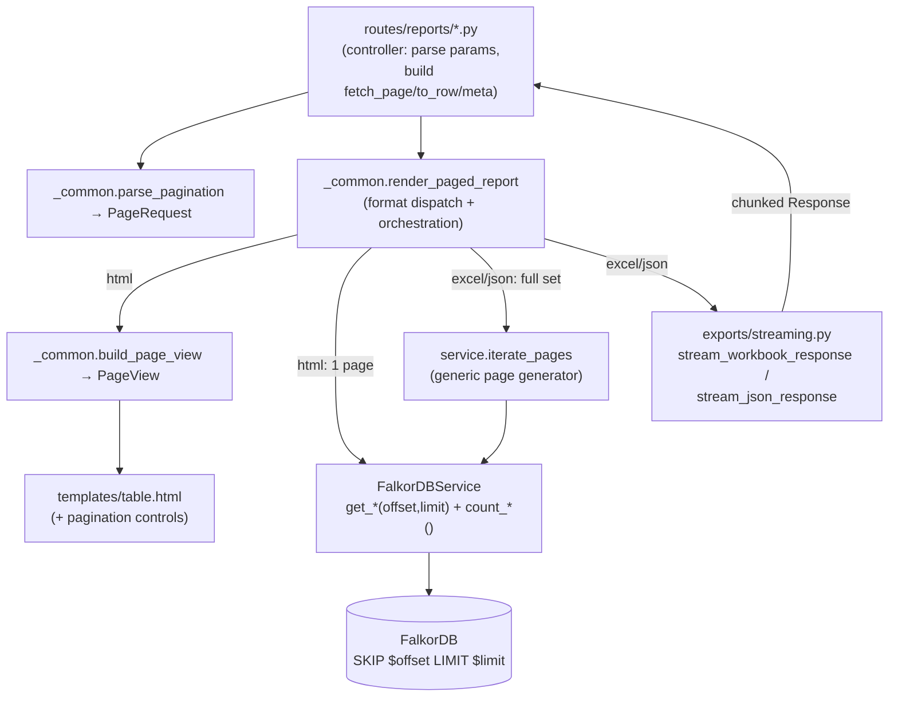
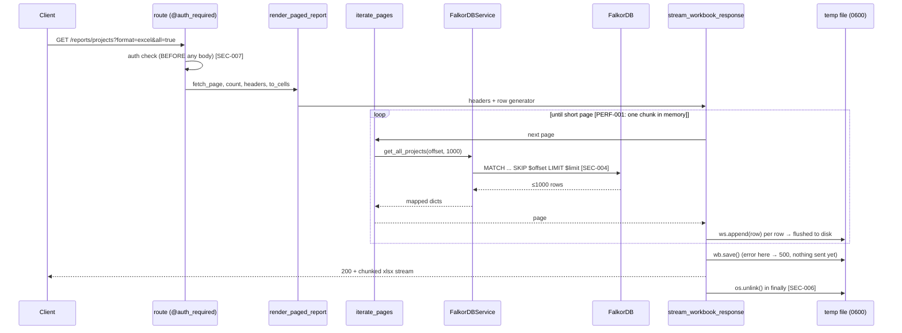

# Phase 1 Architecture: Pagination, Streaming Exports & Bounded Visualizations

**Date:** 2026-06-26 · **Status:** Proposed · **Workflow step:** security-architect (2/4)
**Baseline:** `docs/reporting-overhaul-plan.md` (Phase 1 + §1f) ·
`docs/phase1-pagination-security-privacy-analysis.md` (SRTM: FR-001..007,
SEC-001..009, PRV-001..002, PERF-001..002)

---

## 1. Design goals & guiding principles

| Goal | Principle | How |
|------|-----------|-----|
| Fix OOM (PERF-001, SEC-003) | Fail securely / Economy of mechanism | One page in memory at a time; **no buffered path** exists for any format |
| Least duplication across ~30 routes | DRY / SRP | Format-dispatch + streaming live in **one** Interface Adapter (`render_paged_report`); routes keep only domain specifics |
| Consistent authz (PRV-001) | Complete mediation | The `internal_only` label filter is built once per call and reused by page-query, count-query, and generator |
| Injection-proof paging (SEC-004) | Secure by default | `$offset`/`$limit` are always Cypher **parameters**; values are validated ints before they reach the service |
| Bounded everything (SEC-001/002/005) | Proportionality | `MAX_PAGE_SIZE`, `MAX_RESULT_WINDOW`, `MAX_GRAPH_NODES/EDGES` |

**Clean-architecture placement** (dependencies point inward):

```
Frameworks/Drivers : Flask, FalkorDB, openpyxl, PyVis
Interface Adapters : routes/reports/* (controllers)
                     routes/reports/_common.py  → render_paged_report (NEW, dispatch+orchestrate)
                     exports/streaming.py        → stream writers (NEW, presenters)
Use Cases          : FalkorDBService paged methods (+ count_*) + iterate_pages (NEW)
Entities           : the row dicts (UNCHANGED)
```

---

## 2. Component view



**Key insight:** `iterate_pages` is the single reuse lever. It is a generic generator that drives
*any* offset-aware fetch function, so we do **not** write a bespoke `iter_*` per report.

---

## 3. Interfaces / signatures

### 3a. Pagination params — `routes/reports/_common.py`

```python
from dataclasses import dataclass

DEFAULT_PAGE_SIZE = 100
DB_STREAM_CHUNK = 1000        # internal page size used when streaming exports
MAX_RESULT_WINDOW = 1_000_000 # deep-offset cap (SEC-002 / PERF-002)

@dataclass(frozen=True)
class PageRequest:
    page: int          # 1-based, >= 1
    page_size: int     # 1 .. MAX_PAGE_SIZE
    unlimited: bool    # all=true  (lifts the HTML total cap; exports are always full)

    @property
    def offset(self) -> int:
        return min((self.page - 1) * self.page_size, MAX_RESULT_WINDOW)

def parse_pagination(args=None) -> PageRequest:
    """Validated PageRequest from request.args (or a passed mapping)."""
    args = args if args is not None else request.args
    return PageRequest(
        page=validate_page(args.get("page", type=int)),
        page_size=validate_page_size(args.get("page_size", type=int)),
        unlimited=validate_boolean(args.get("all")),
    )
```

### 3b. Validation — `utils/validation.py`

```python
MAX_PAGE_SIZE = 1000

def validate_page(value: int | None, default: int = 1) -> int:
    return validate_int_param(value, default=default, min_val=1, max_val=MAX_RESULT_WINDOW)

def validate_page_size(value: int | None, default: int = DEFAULT_PAGE_SIZE) -> int:
    return validate_int_param(value, default=default, min_val=1, max_val=MAX_PAGE_SIZE)
```

> Reuses the existing `validate_int_param` (already clamps to default on non-numeric/out-of-range),
> so SEC-001/002 fall out of one well-tested primitive. `MAX_PAGE_SIZE` lives next to `MAX_LIMIT`.

### 3c. Service — `services/falkordb_service.py`

Each list method gains `offset` + a sibling `count_*`. The label filter is built **once** and
shared. Example (projects); the same shape applies to applications, vulnerabilities, etc.:

```python
def get_all_projects(self, limit=DEFAULT_PAGE_SIZE, offset=0, internal_only=False) -> list[dict]:
    node_label = self.get_node_label(internal_only)        # single source of the authz filter
    query = f"""
        MATCH (v:{node_label})
        ... OPTIONAL MATCHes ...
        WITH ...
        RETURN ...
        ORDER BY project_name, version          # stable order → correct paging
        SKIP $offset LIMIT $limit
    """
    rows = self.execute_query(query, {"offset": offset, "limit": limit})  # parameterised (SEC-004)
    return [self._map_project_row(r) for r in rows]      # mapper extracted for reuse

def count_all_projects(self, internal_only=False) -> int:
    node_label = self.get_node_label(internal_only)        # SAME filter (PRV-001 / SEC-009)
    rows = self.execute_query(
        f"MATCH (v:{node_label}) RETURN count(v) AS n", {})
    return int(rows[0][0]) if rows else 0
```

Generic generator (used by all streaming exports — written **once**):

```python
from collections.abc import Callable, Iterator

def iterate_pages(fetch_page: Callable[[int, int], list], chunk: int = DB_STREAM_CHUNK) -> Iterator[list]:
    """Yield successive pages from any offset-aware fetcher until exhausted.
    Holds at most one chunk in memory (PERF-001 / SEC-003)."""
    offset = 0
    while True:
        page = fetch_page(offset, chunk)
        if not page:
            return
        yield page
        if len(page) < chunk:
            return
        offset += chunk
```

### 3d. Central report renderer — `routes/reports/_common.py`

```python
def render_paged_report(
    *,
    req: PageRequest,
    output_format: str,                       # 'html' | 'excel' | 'json'
    fetch_page: Callable[[int, int], list[dict]],   # (offset, limit) -> rows
    count: Callable[[], int],
    headers: list[str],
    to_cells: Callable[[dict], list],         # row dict -> HTML/Excel cells
    to_json_row: Callable[[dict], dict] | None = None,  # default: identity
    title: str,
    base_url: str,
    params: dict,                             # current filter params (internal_only, name, ...)
    filename_stem: str,
    report_type: str,
    schema_url: str | None = None,
    stats_builder: Callable[[int], dict] | None = None,  # total -> stats dict
    template: str = TABLE_TEMPLATE,
    extra_toggles: list | None = None,
) -> Response:
    if output_format == "excel":
        page_iter = iterate_pages(fetch_page)               # FULL set, streamed
        rows = (to_cells(d) for page in page_iter for d in page)
        return stream_workbook_response(headers, rows, f"{filename_stem}.xlsx", title)

    if output_format == "json":
        page_iter = iterate_pages(fetch_page)               # FULL set, streamed
        meta = {"report_type": report_type, "generated_at": ts(), **params}
        json_rows = ((to_json_row or (lambda d: d))(d) for page in page_iter for d in page)
        return stream_json_response(meta, json_rows, f"{filename_stem}.json",
                                    stats=stats_builder and stats_builder(count()))

    # HTML — exactly ONE page (never renders more than page_size rows; bounded by SEC-001)
    total = count()
    page = fetch_page(req.offset, req.page_size)
    page_view = build_page_view(req, total, base_url, params)
    return Response(render_template(
        template, title=title, headers=headers,
        data=[to_cells(d) for d in page],
        pagination=page_view, stats=stats_builder(total) if stats_builder else None,
        excel_url=build_url_with_params(base_url, format="excel", **params),
        json_url=build_url_with_params(base_url, format="json", **params),
        schema_url=schema_url, extra_toggles=extra_toggles,
        internal_only=params.get("internal_only", False),
    ), mimetype="text/html")
```

A route then collapses to its domain essentials (illustrative — `/reports/projects`):

```python
@bp.route("/projects")
@auth_required
def all_projects():
    req = parse_pagination()
    internal_only = validate_boolean(request.args.get("internal_only"))
    svc = get_falkordb_service()
    params = {"internal_only": internal_only}
    return render_paged_report(
        req=req, output_format=validate_format(request.args.get("format")),
        fetch_page=lambda off, lim: svc.get_all_projects(limit=lim, offset=off, internal_only=internal_only),
        count=lambda: svc.count_all_projects(internal_only),
        headers=PROJECT_HEADERS, to_cells=_project_cells, to_json_row=_project_json,
        title=get_internal_title("Projects", internal_only),
        base_url="/reports/projects", params=params,
        filename_stem="all_projects", report_type="projects",
        schema_url="/schemas/projects",
        stats_builder=lambda total: {"Total Project Versions": total},
    )
```

### 3e. Paging view for HTML — `routes/reports/_common.py`

```python
PAGE_SIZE_OPTIONS = (25, 50, 100, 250, 1000)

@dataclass(frozen=True)
class PageView:
    page: int
    pages: int           # ceil(total/page_size); unbounded if req.unlimited but total known
    total: int
    page_size: int
    prev_url: str | None
    next_url: str | None
    size_urls: dict[int, str]   # page_size option -> url

def build_page_view(req, total, base_url, params) -> PageView: ...
```

`table.html` gains a controls block, rendered only when `pagination` is passed (back-compat: every
existing caller that doesn't pass it is unaffected — FR-007):

```html

<nav class="pagination">
  <a href="{{ pagination.prev_url }}">&laquo; Prev</a>
  <span>Page {{ pagination.page }} of {{ pagination.pages }} ({{ pagination.total }} total)</span>
  <a href="{{ pagination.next_url }}">Next &raquo;</a>
  <select id="pageSizeSelect">
    
      <option value="{{ url }}" {{ 'selected' if size == pagination.page_size }}>{{ size }}/page</option>
    
  </select>
</nav>

```

### 3f. Streaming writers — `exports/streaming.py` (NEW)

```python
def stream_workbook_response(headers, row_iter, filename, sheet_title="Report") -> Response:
    """openpyxl write_only → secure temp file → chunked file stream → unlink.
    Constant memory (cells flushed to disk); errors handled BEFORE response status commits."""
    # 1. fd, path = tempfile.mkstemp(suffix=".xlsx", dir=current_app.config["EXPORT_TMP_DIR"])  → 0600
    # 2. wb = Workbook(write_only=True); ws = wb.create_sheet(sheet_title); ws.append(headers)
    # 3. for row in row_iter: ws.append(row)          # one row in memory at a time
    # 4. wb.save(path)                                  # any error here → 500, nothing streamed yet
    # 5. return Response(_read_and_unlink(path, fd), mimetype=XLSX_MIME,
    #                    headers={"Content-Disposition": sanitize_content_disposition(...attachment...)})
    #    _read_and_unlink yields 64KB chunks then os.unlink in finally (SEC-006 guaranteed cleanup)

def stream_json_response(meta, row_iter, filename, data_key="data", stats=None) -> Response:
    """stream_with_context: emit envelope head, comma-joined rows per chunk, then tail.
    A mid-stream failure logs server-side and ends the generator → the JSON never closes,
    so the client detects a truncated (invalid) document (SEC-007 fail-detectable)."""
    @stream_with_context
    def gen():
        head = json.dumps(meta)[:-1]            # '{...' without closing brace
        yield f'{head},"{data_key}":['
        first = True
        try:
            for row in row_iter:
                yield ("" if first else ",") + json.dumps(row, default=str); first = False
        except Exception:
            logger.exception("report stream failed"); return   # truncated → invalid JSON
        tail = f'],"stats":{json.dumps(stats)}' if stats is not None else "]"
        yield tail + "}"
    return Response(gen(), mimetype="application/json",
                    headers={"Content-Disposition": sanitize_content_disposition(f"attachment; filename={filename}")})
```

### 3g. Visualizations — cap + stream (`visualizations/*.py`, `routes/visualizations.py`)

```python
MAX_GRAPH_NODES = 2000        # validated cap (SEC-005)
MAX_GRAPH_EDGES = 5000

def build_bounded_network(edges_iter, *, max_nodes, max_edges, build_node, build_edge):
    """Consume edges from a generator, stop at the cap, return (net, truncated, dropped)."""
    # add nodes/edges until a cap is hit; count dropped; set truncated=True

# route: stream the generated HTML in chunks, inject a truncation banner when truncated
def _bipartite_impl(...):
    net, truncated, dropped = build_bounded_network(svc.iter_direct_dependant_edges(...), ...)
    html = net.generate_html()
    if truncated:
        html = _inject_truncation_banner(html, MAX_GRAPH_NODES, dropped)  # + logger.warning
    return Response(_chunked(html), mimetype="text/html")
```

> Honest trade-off: PyVis builds the whole HTML string internally, so streaming the response is a
> secondary memory win — **the node/edge cap is the primary DoS control** (ST-004/SAC-004). Feeding
> the builder from a generator also stops the *DB result set* being fully materialised.

---

## 4. Sequence — streamed `all=true` Excel export (the OOM-critical path)



---

## 5. Rollout across ~30 endpoints — decorator vs helper

**Decision: a shared *render helper* (`render_paged_report`), not a decorator.** A decorator would
have to guess each report's service method, columns, filename, and stats — a leaky abstraction
fighting the codebase's explicit style. The helper centralises the genuinely-shared logic (3-way
format dispatch, streaming, pagination view) while each route declares only what is unique
(which `fetch_page`/`count`, which columns, which filters). See ADR-001.

**Migration order (incremental, low-risk):**
1. Land the primitives: `validate_page/page_size`, `parse_pagination`, `iterate_pages`,
   `exports/streaming.py`, `render_paged_report`, `build_page_view`, `table.html` controls.
2. Convert `/reports/projects` and `/reports/applications` first (reference implementations).
3. Roll the same 6-line pattern across the remaining `routes/reports/*` modules.
4. Apply the viz cap+stream to `visualizations/*` and the embedded report graphs.

Endpoints already returning naturally-small, pre-aggregated result sets (dashboards, heatmaps,
single-record summaries) get pagination only where it adds value; all gain the streaming export
path for free via the helper.

---

## 6. Failure modes & data lifecycle

| Component | Failure | Behaviour |
|-----------|---------|-----------|
| Excel writer | error during `wb.save` | 500 returned cleanly (status not yet committed); temp file unlinked |
| Excel stream | client disconnects mid-download | generator `finally` unlinks temp file (no leak) |
| JSON stream | error mid-stream | logged; generator ends → JSON unterminated → client sees parse failure (fail-detectable) |
| count vs rows | data changes mid-export | export reflects rows actually read; `total` is best-effort — documented, acceptable |
| Deep offset | `page` beyond `MAX_RESULT_WINDOW` | clamped; UI shows last reachable page (PERF-002) |

**Data lifecycle:** export temp files are transient — created in `EXPORT_TMP_DIR`, 0600, deleted
immediately after streaming (or on error). No new persistent storage; no new PII (PRV-002).

---

## 7. ADRs

**ADR-001 — Central render helper over per-route code or a decorator.** *Accepted.* Centralises
format dispatch + streaming once (SRP/DRY); routes stay explicit and testable; avoids a leaky
"magic" decorator. *Consequence:* one well-tested path for all reports; a bug fixed once fixes all.
*Security:* single choke point to enforce parameterisation, auth-before-stream, and filter
consistency.

**ADR-002 — Excel buffers to a secure temp file then streams; JSON streams directly.** *Accepted.*
openpyxl cannot emit a valid xlsx incrementally over HTTP, and write_only flushes cells to disk →
constant memory; saving to disk first also lets errors return a clean 500 before the response
commits. JSON can stream directly via `stream_with_context` for low latency; truncation-on-error is
acceptable and detectable. *Consequence:* Excel needs `EXPORT_TMP_DIR` + disk; JSON does not.

**ADR-003 — Exports always return the full set, streamed; HTML always renders exactly one bounded
page.** *Accepted.* Matches the requirement ("bring back all results, saved page by page") and
removes any buffered/unbounded-HTML path, so `all=true` cannot OOM (SEC-003). `all=true` only lifts
the *total* cap for UI navigation; `page_size` (≤1000) bounds every rendered page.

**ADR-004 — Generic `iterate_pages` + `offset`/`count_*` per method, not bespoke `iter_*`.**
*Accepted.* One generator drives every offset-aware fetcher → minimal duplication; the row-mapping
stays in each service method where the schema knowledge lives.

**ADR-005 — Bound the result window; defer keyset pagination.** *Accepted.* `MAX_RESULT_WINDOW`
caps deep `SKIP`. Keyset/cursor pagination (ORDER BY a stable key, `WHERE key > $last`) is the
performant long-term answer for very deep traversal — recorded as PERF-002 future work, not Phase 1.

---

## 8. New requirements surfaced (feedback → secure-privacy-by-design)

This design surfaced items not in the original Phase 1 inputs:
- **CFG-001:** `EXPORT_TMP_DIR` config (default to the OS/scratch temp dir) for Excel streaming temp files.
- **CFG-002:** `DB_STREAM_CHUNK` (internal export page size) and `MAX_RESULT_WINDOW` as configurable constants.
- **OPS-001:** export temp-file cleanup must survive worker restarts (orphan sweep on startup, or rely on OS tmp reaping) — minor.
- **PERF-002 (confirmed):** keyset pagination as the future fix for deep-offset cost.

These are low-risk/config-level; they can be folded into Phase 1 implementation and noted in the
SRTM rather than requiring a full re-run. **SEC-008 (rate limiting) and COMP-003 (export audit
logging)** remain flagged as candidate fast-follows — recommend confirming scope with the product
owner before the test/implementation step.

---

## 9. Handoff

- **threat-modeling (next):** validate ST-001..ST-009 against this design — in particular that
  (a) no buffered path survives for `all=true`/exports, (b) page/count/generator share the filter,
  (c) `$offset`/`$limit` are parameters, (d) temp-file lifecycle is leak-free, (e) the viz cap holds.
- **software-test-engineer (after):** implement TA-001..TA-020 as failing tests against these
  signatures (the helper + writers are the main seams to test).
