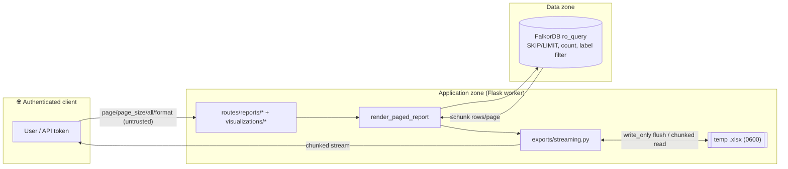

# Threat Model: SBOM-Graph Reporting — Phase 1 (Pagination, Streaming Exports, Bounded Visualizations)

**Date:** 2026-06-26 · **Workflow step:** threat-modeling (3/4) · **Scope:** design validation
**Inputs:** `phase1-pagination-security-privacy-analysis.md` (ST-001..009, SAC-001..005) ·
`phase1-pagination-architecture.md` (render_paged_report, iterate_pages, offset/count_*,
exports/streaming.py, bounded PyVis, MAX_PAGE_SIZE=1000 / MAX_RESULT_WINDOW=1M / MAX_GRAPH_NODES).

## Context & Scope
Validating only the **new** Phase 1 surface on an authenticated (`@auth_required`) internal Flask
API over FalkorDB. **In scope:** paging params, `all=true` streaming exports, temp-file Excel,
streamed JSON, bounded visualizations. **Out of scope:** auth mechanism, ingestion, Phases 2–7.
No PII (supply-chain metadata only); no AI/ML; cloud = internal K8s (not analysed here).

**Grounding facts verified in code:**
- `execute_query` uses `graph.ro_query(...)` — **read-only**. Even a hypothetical injection cannot
  write/delete. Strong backstop for the injection class.
- `LIMIT $limit` is already used across the service → FalkorDB **accepts a parameterised LIMIT** ✓.
- **No existing `SKIP`** anywhere → whether FalkorDB accepts a parameterised `SKIP $offset` is
  unverified (see T-2).

## Attack Surface Summary

Trust boundaries: client→worker (params validated at `parse_pagination`), worker→FalkorDB
(parameterised Cypher + label filter), worker→local FS (temp file lifecycle).

## STRIPED Analysis

### Tampering / Elevation — Cypher injection via paging params — Severity: Low (well-mitigated)
`[OWASP A03]` ST-003/SAC-003. `page`/`page_size`/`all` are validated to ints/bool *before* the
service, and `$offset`/`$limit` are query parameters. Defence-in-depth: queries run via `ro_query`
(read-only). **Verdict: mitigated.** Residual only if a future method string-builds an unvalidated
value — covered by test TA-011 (assert parameters, not interpolation).

### Information Disclosure — `internal_only` filter drift across page/count/generator — Severity: Medium → design-hardening recommended
`[OWASP A01]` ST-006/SAC-005. The page query, `count_*`, and the generator each call
`get_node_label(internal_only)`. They produce the correct filter **only if every one of them is
written to do so** — the design relies on developer discipline across ~30 endpoints, and a count
that silently drops the `:INTERNAL` label would leak internal-inventory counts/rows.
**Recommendation (hardening, not re-architecture):** make divergence structurally hard — have the
page method and its `count_*` derive the `MATCH (v:<label>)` prefix from a single private helper
(e.g. `self._versions_match(internal_only) -> (clause, params)`) used by both, so the filter cannot
drift. Enforce with TA-016 (count==rows) and TA-017 (internal_only never returns non-internal,
across page **and** count **and** stream).

### Denial of Service — `all=true` / exports buffered → OOM — Severity: High threat, **mitigated by design**
ST-001/SAC-001. ADR-003 removes every buffered path: exports always stream via `iterate_pages`
(≤1 chunk in memory); HTML renders exactly one bounded page. **Verdict: mitigated**, contingent on
implementation holding the invariant — TA-008 must assert no full list is built (generator-call/peak
memory check). This is the single most important invariant to test.

### Denial of Service — deep `SKIP` is O(offset) per request — Severity: Medium (residual)
Graph engines scan and discard `offset` rows for `SKIP`. With `MAX_RESULT_WINDOW=1_000_000`, a user
paging to a high offset (or scripting sequential deep pages, or streaming a huge export which walks
offsets 0…N) forces increasingly expensive scans — a CPU/DB-load amplifier even though memory stays
flat. **Recommendations:** (a) set `MAX_RESULT_WINDOW` conservatively (e.g. 100k) for *interactive
HTML* paging; (b) for full **exports**, prefer **keyset** iteration in `iterate_pages` for the large
labels (ORDER BY a stable unique key, `WHERE key > $last LIMIT $chunk`) instead of growing `SKIP` —
this also makes streaming O(total) not O(total²); (c) rate-limit (SEC-008). Keyset was deferred to
PERF-002, but the O(offset²) export cost raises its priority — flag to product owner.

### Denial of Service — count(v) is O(n) on large labels, run on every HTML page — Severity: Medium (residual)
FalkorDB has no stored label cardinality; `RETURN count(v)` scans the label. Every HTML page load
pays a full scan for the total. **Recommendation:** offer a `has_next` mode (fetch `page_size+1`,
omit absolute total) for the largest reports, or cache counts briefly. SEC-009 already allows the
`page_size+1` fallback — make it the default for the heaviest endpoints.

### Denial of Service — visualization graph bomb — Severity: High threat, **mitigated**
ST-004/SAC-004. `MAX_GRAPH_NODES/EDGES` cap + early generator stop bounds both DB read and PyVis
build; truncation surfaced + logged. **Verdict: mitigated.** Note `generate_html()` still builds one
string for ≤cap nodes — acceptable at 2000. Tune the cap conservatively (TA-012).

### Information Disclosure — temp-file exposure / leak — Severity: Low (mitigated)
ST-005. `mkstemp(dir=EXPORT_TMP_DIR)` → mode 0600, unpredictable name; `finally: os.unlink`.
**Residual:** orphaned temp files after a hard worker crash (SIGKILL/OOM mid-export). **Mitigation:**
startup orphan sweep of `EXPORT_TMP_DIR`, or rely on OS tmp reaping; bound disk via SEC-008.

### Information Disclosure — mid-stream error leaks data/partial-as-complete — Severity: Low (mitigated)
ST-007. Excel: errors occur during `wb.save` **before** the 200 commits → clean 500, no leak. JSON:
`stream_with_context` generator catches, logs server-side (no stack to client), and ends → the
document never closes → **invalid/truncated JSON** the client must reject. **Recommendation:**
document "a truncated stream = failure"; ensure the `except` does **not** emit a closing `]}` (which
would forge a complete-looking doc). Covered by TA-014.

### Repudiation — bulk inventory export unlogged — Severity: Medium (fast-follow)
ST-009/PAC-001/COMP-003. A full internal-inventory export leaves no audit record. No access logging
exists today. **Fast-follow:** structured access log (identity, endpoint, format, `all`, row/byte
count, ts) — recommend a one-line hook in `render_paged_report` (single choke point). Confirm scope.

### Denial of Service — no rate limiting on heavy endpoints — Severity: Medium (fast-follow)
ST-008/SEC-008. Reports/exports/visualizations are unthrottled (only login is rate-limited).
Combined with the O(offset) and O(n)-count costs above, repeated/parallel `all=true` or deep-page
requests can saturate FalkorDB/workers. **Fast-follow:** per-identity throttle + concurrency cap on
the heavy endpoints (reuse the auth.py limiter pattern; shared store later). Confirm scope.

## Design Flaw Summary — address before/with implementation
1. **Filter single-source (Medium).** Don't rely on each method remembering the `:INTERNAL` filter —
   derive the page query's and `count_*`'s MATCH prefix from one helper so page/count/generator
   cannot diverge. *(Hardening; no re-architecture.)*
2. ~~**Verify `SKIP $offset` parameterisation on FalkorDB (T-2).**~~ **RESOLVED 2026-06-26** —
   verified against FalkorDB (redis-py 7.4.0) that a parameterised `SKIP $offset` is accepted and
   behaves identically to a literal. All paged queries now use `SKIP $offset LIMIT $limit` fully
   parameterised; the validated-int fallback was dropped.
3. **Re-weight keyset vs SKIP for exports (Medium).** Full-set export over growing `SKIP` is O(total²)
   in DB work. Use keyset iteration for the large labels in `iterate_pages`, or cap export size and
   document it. Was PERF-002/future; the export path raises its priority.
4. **Default the heaviest HTML reports to `has_next` (page_size+1), not absolute count (Medium).**
   Avoids an O(n) scan on every page view.

None of these require throwing away the architecture — they are constant-tuning + a small filter
helper + one early DB-capability check. **No Critical findings; no blocking re-architecture.**

## Risk Register

| ID | Threat | Category | Reference | Severity | Likelihood | Mitigation | Status |
|----|--------|----------|-----------|----------|------------|------------|--------|
| T-1 | `all=true`/export buffered → OOM | STRIPED-D | ST-001 | High | High→Low | Streaming-only (ADR-003); assert no full list (TA-008) | Mitigated by design |
| T-2 | `SKIP $offset` unsupported → interpolation regression | STRIPED-T | A03 / ST-003 | Medium | Low | **Verified 2026-06-26**: FalkorDB accepts parameterised `SKIP $offset` — now fully parameterised, fallback dropped | Resolved |
| T-3 | Cypher injection via paging params | STRIPED-T/E | A03 / SAC-003 | Low | Low | Validated ints + `$params` + `ro_query` | Mitigated |
| T-4 | `internal_only` filter drift | STRIPED-I | A01 / SAC-005 | Medium | Medium | Single-source filter helper; TA-016/017 | Open (harden) |
| T-5 | Deep `SKIP` O(offset) CPU/DB DoS | STRIPED-D | ST-002 | Medium | Medium | Lower window for HTML; keyset for exports; rate limit | Open |
| T-6 | `count(v)` O(n) per HTML page | STRIPED-D | ST-002 | Medium | Medium | `page_size+1` has_next default on heavy reports | Open |
| T-7 | Visualization graph bomb | STRIPED-D | SAC-004 | High | Medium→Low | Node/edge cap + early stop + truncation notice | Mitigated by design |
| T-8 | Temp-file leak (orphan on crash) | STRIPED-I | ST-005 | Low | Low | mkstemp 0600 + finally unlink + startup sweep | Mitigated |
| T-9 | Mid-stream JSON error → partial doc | STRIPED-I | ST-007 | Low | Low | No forged closing `]}`; truncation=failure; Excel saves before 200 | Mitigated |
| T-10 | Unlogged bulk export | STRIPED-R | COMP-003 | Medium | Medium | Access-log hook in render_paged_report | Fast-follow |
| T-11 | No rate limit on heavy endpoints | STRIPED-D | SEC-008 | Medium | Medium | Per-identity throttle + concurrency cap | Fast-follow |

## Handoff to software-test-engineer
Write failing tests first, prioritising the invariants that carry the design:
- **TA-008** (no buffered path / constant memory) — the keystone for T-1.
- **TA-016 + TA-017** (count==rows; internal_only never leaks across page **and** count **and** stream) — for T-4.
- **TA-011** (parameterised paging, not interpolation) — for T-3; add a case asserting `SKIP`/`LIMIT` use params or a validated int.
- **TA-013 / TA-014** (temp-file 0600 + cleanup on success and error; JSON truncation not forged-complete) — for T-8/T-9.
- **TA-009 / TA-010 / TA-012** (page_size/offset bounds; graph cap+truncation) — for T-5/T-7.
- Decide T-2 (SKIP capability) and items 1/3/4 of the Design Flaw Summary at implementation start.
- Confirm with product owner whether **T-10 (audit log)** and **T-11 (rate limit)** are in Phase 1 or fast-follow before writing TA-015/TA-020.
