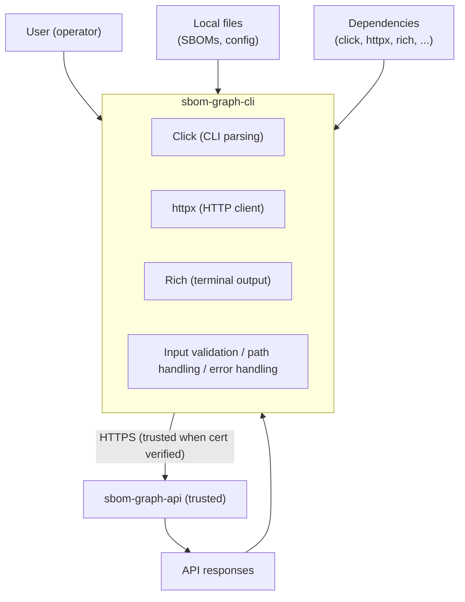

# Threat Model: sbom-graph-cli

## Summary

sbom-graph-cli is a thin HTTP client that provides a command-line interface for the sbom-graph API. It enables SBOM ingestion, vulnerability and dependency querying, policy annotation, and report export. The CLI has no direct database access; all operations are performed via HTTP requests to sbom-graph-api. Authentication uses a Bearer token supplied via environment variable or `--token` flag. As an internal tool, the threat surface is limited to local execution, API communication, and dependency supply chain. This document provides a comprehensive STRIDE threat analysis with mitigations and residual risk assessment.

---

## Assets and Trust Boundaries

### Assets

| Asset | Location | Sensitivity |
|-------|----------|-------------|
| API token | Environment variable (`SBOM_GRAPH_TOKEN`) or `--token` CLI arg -- no config file or persistent local storage exists in the current implementation | High — grants API access |
| SBOM files | Local filesystem (user-specified path) | Medium — may contain proprietary dependency data |
| API responses | In-memory during execution | Medium — vulnerability and policy data |
| Export output | Local filesystem or stdout | Medium — report content |
| User session | Terminal process | Low — CLI state |

### Entry Points

| Entry Point | Type | Description |
|-------------|------|-------------|
| Command-line arguments | User input | All commands accept args (file paths, PURLs, defect IDs, report names) |
| Environment variables | Configuration | `SBOM_GRAPH_API_URL`, `SBOM_GRAPH_TOKEN` |
| Local SBOM files | File I/O | Read for ingest; content POSTed to API |
| API responses | Network | JSON and binary (Excel/CSV) from sbom-graph-api |
| Export output path | File I/O | `-o` / `--output` for report export |

### Trust Boundaries

---

## Threat Analysis

| # | Threat | STRIDE | Asset | Likelihood | Impact | Risk | Status | Mitigation |
|---|--------|--------|-------|------------|--------|------|--------|------------|
| C1 | Token exposure in process listing | I | Token | Medium | Medium | Medium | MITIGATED | Use `SBOM_GRAPH_TOKEN` env var instead of `--token`; env vars are not visible in `ps` output. Document in README. |
| C2 | Token in shell history | I | Token | High | Medium | Medium | MITIGATED | Env var avoids history; if `--token` is used, it is stored in `.bash_history` etc. Recommend env var in docs. |
| C3 | Token in shell profile/env files with weak permissions | I | Token | Medium | Medium | Medium | ACCEPTED | No config file mechanism exists in the current implementation (verified against `cli.py`) -- the only persistence a user could introduce is exporting `SBOM_GRAPH_TOKEN` in their own shell profile (`.bashrc`, `.env`, etc.). User responsibility; recommend `chmod 600` on any such file. |
| C4 | Path traversal on ingest file path | T | Local FS | Low | Medium | Low | MITIGATED | `click.Path(exists=True)` validates path exists; user controls path. For internal CLI, operator is trusted. Reject symlinks if needed. |
| C5 | Path traversal on export output path | T | Local FS | Low | Medium | Low | ACCEPTED | `-o` accepts any path; user can overwrite files. Internal tool; operator controls destination. No `exists=True` so new files can be created. |
| C6 | Malicious/tampered API response causing crash or injection | T | CLI | Low | Medium | Low | MITIGATED | `response.json()` may raise on malformed JSON; APIError extracts `error` key. API is trusted; if compromised, broader impact. Defensive: validate response structure. |
| C7 | Output injection via malicious data in API responses rendered to terminal | I | Terminal | Medium | Low | Low | ACCEPTED | Rich interprets `[tag]` markup in table cells by default. Malicious API could inject `[link=...]` etc. Mitigation: use `rich.markup.escape()` on API-sourced strings before `add_row()`. Not yet implemented. |
| C8 | Dependency supply chain (click, httpx, rich) | D | Libs | Low | High | Medium | MITIGATED | Dependencies pinned in `uv.lock`; SCA (Sonatype IQ) required per AGENTS.md. No known CVEs in current versions (see Third-Party Assessment). |
| C9 | MITM on API connection | T | Network | Medium | High | Medium | MITIGATED | httpx verifies SSL by default. Default `--api-url` is `http://localhost:5000` for dev; production must use HTTPS. Document requirement. |
| C10 | Credential stuffing via CLI automation | S | API | Low | Medium | Low | ACCEPTED | API responsibility; rate limiting and auth belong to sbom-graph-api. CLI is a client; scripted token attempts are an API concern. |
| C11 | SBOM file content injection (malicious JSON in uploaded SBOM) | T | API/CLI | Low | Medium | Low | MITIGATED | CLI reads and POSTs JSON; API parses. Malicious JSON (e.g. billion laughs, deeply nested) could cause `json.load()` DoS on CLI. API validates SBOM schema. CLI trusts local file; operator controls input. |
| C12 | Denial of service via large API response consuming memory | D | CLI | Low | Medium | Low | MITIGATED | httpx loads full response into memory; no streaming. 60s timeout limits request duration. Very large responses could cause OOM. Acceptable for internal use; consider streaming for future high-volume reports. |
| C13 | Information disclosure via verbose error messages | I | Internal state | Low | Low | Low | MITIGATED | APIError message comes from API `error` key or `response.text`; not exception tracebacks. Per AGENTS.md, no exception details in HTTP responses. CLI surfaces API message only; no stack traces to user. |

---

## Recommendations

1. **Token handling**: Prefer `SBOM_GRAPH_TOKEN` environment variable over `--token` to avoid process listing and shell history exposure. Document this in README and threat model.

2. **Production configuration**: Require HTTPS for `SBOM_GRAPH_API_URL` in production. Consider adding a `--insecure` flag (default: false) to allow dev over HTTP, with a warning when HTTP is used.

3. **Rich output injection (C7)**: Apply `rich.markup.escape()` to all API-sourced strings before passing to `Table.add_row()` in query, ingest, and policy commands. This prevents malicious API responses from injecting markup.

4. **Path validation**: For ingest, consider resolving paths to canonical form and rejecting symlinks if reading sensitive SBOMs in shared environments. For export `-o`, consider validating path is within a safe directory for automation use cases.

5. **SBOM size limits**: Consider a configurable max file size for ingest to mitigate `json.load()` DoS from extremely large or maliciously crafted files.

6. **Defect ID validation**: Add basic validation for `patch-plan` defect_id (e.g. alphanumeric, hyphens, slashes) to reduce risk of malformed URLs. API should also validate.

7. **SCA and SAST**: Continue mandatory Sonatype IQ (SCA) and Bandit/Snyk Code (SAST) per AGENTS.md. Run scans when dependencies change.

---

## Residual Risk

| Risk | Severity | Justification |
|------|----------|---------------|
| Token in config with weak permissions | Low | User responsibility; internal tool; document best practices. |
| Export path overwrite | Low | Operator-controlled; internal CLI; no elevation of privilege. |
| Rich markup injection from API | Low | API is trusted; impact limited to terminal display (no code execution). Mitigation available if needed. |
| Credential stuffing | Low | API enforces rate limits and auth; CLI is passive client. |
| SBOM JSON DoS | Low | Operator controls file; 60s timeout; internal use. |
| Large response OOM | Low | Internal tool; typical report sizes manageable; timeout limits exposure. |

---

## Third-Party Component Assessment

| Criterion | click | httpx | rich |
|-----------|-------|-------|------|
| **CVEs last 2yr** | None known | CVE-2021-41945 (fixed in 0.23+); CVE-2025-43859 (h11, indirect). Current 0.25+ OK. | None known |
| **Last release** | 8.3.1 (Nov 2025) | 0.28.x (active) | 13.x / 14.x (active) |
| **Contributors** | Pallets team, established | Encode, well-maintained | Textualize, active |
| **License** | BSD-3-Clause | BSD | MIT |
| **Maintenance** | Active | Active | Active |
| **Risk** | Low | Low (use ≥0.25) | Low |

**Notes**:
- click: No known CVEs; minimal attack surface (CLI parsing).
- httpx: CVE-2021-41945 (SSRF) fixed in 0.23.0; project uses ≥0.25. CVE-2025-43859 affects h11 (chunked encoding); ensure httpcore/h11 are current via uv.lock.
- rich: No CVEs; markup injection is an application-level concern (see C7).

---

## Revision History

| Version | Date | Author | Changes |
|---------|------|--------|---------|
| 1.1 | 2026-07-28 | AI-assisted audit | Re-verified against current `src/`. Corrected the Assets table and C3: no config-file token storage exists in the implementation (only `SBOM_GRAPH_TOKEN` env var / `--token` flag) -- the prior text implied a config file mechanism that was never built. No other drift found in this document. |
| 1.0 | 2025-03-12 | — | Initial comprehensive STRIDE threat model; expands Phase F with C1–C13. |
