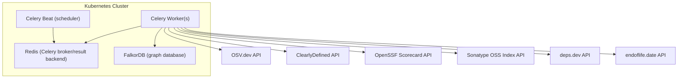

# Threat Model: sbom-graph-enrichment

## Summary

The enrichment pipeline is a Celery-based asynchronous system that queries six external APIs (OSV.dev, ClearlyDefined, OpenSSF Scorecard, Sonatype OSS Index, deps.dev, endoflife.date) to enrich package metadata in the FalkorDB graph database. It also computes composite trust scores and propagates inherited risk through the dependency graph. Key risks include external API data integrity, credential management for OSS Index, rate limiting exhaustion, and stale/incorrect scoring data.

## Enrichment Architecture

## Assets and Trust Boundaries

### Assets

| Asset                                                                   | Sensitivity |
| ----------------------------------------------------------------------- | ----------- |
| FalkorDB graph data (dependency relationships, vulnerability data)      | **High**    |
| OSS Index API credentials (OSSINDEX_USER/OSSINDEX_TOKEN)                | **Medium**  |
| Redis broker credentials (embedded in Celery URL)                       | **High**    |
| Trust score computation results                                         | **Medium**  |
| Raw API responses (Scorecard, deps.dev JSON cached in TrustScore nodes) | **Low**     |

### Trust Boundaries

| Boundary                       | Protocol                    |
| ------------------------------ | --------------------------- |
| Worker -> OSV.dev API          | HTTPS                       |
| Worker -> ClearlyDefined API   | HTTPS                       |
| Worker -> Scorecard API        | HTTPS                       |
| Worker -> OSS Index API        | HTTPS (optional Basic auth) |
| Worker -> deps.dev API         | HTTPS                       |
| Worker -> endoflife.date API   | HTTPS                       |
| Worker -> FalkorDB             | Redis protocol (+/- TLS)    |
| Worker -> Redis broker         | Redis protocol (+/- TLS)    |
| Beat scheduler -> Redis broker | Redis protocol              |

## Threat Analysis

| #   | Threat                                                  | STRIDE | Asset                           | Likelihood | Impact | Risk   | Mitigation                                                                                                      |
| --- | ------------------------------------------------------- | ------ | ------------------------------- | ---------- | ------ | ------ | --------------------------------------------------------------------------------------------------------------- |
| E1  | External API response tampering                         | T      | Trust scores                    | Low        | High   | Medium | HTTPS transport, explicit field extraction, multi-source cross-validation                                       |
| E2  | OSS Index credential theft from env vars                | I      | OSSINDEX_USER/TOKEN             | Low        | Medium | Low    | Kubernetes Secret, optional (system works without), read-only API                                               |
| E3  | Rate limit exhaustion causing API bans                  | D      | External API access             | Medium     | Medium | Medium | Per-certifier token-bucket rate limiting, configurable intervals                                                |
| E4  | Stale trust scores misleading CI/CD gates               | I      | Trust scores                    | Medium     | Medium | Medium | scored_at timestamp, periodic re-computation via beat schedule                                                  |
| E5  | Worker process memory credential exposure               | I      | Redis password, OSS Index creds | Low        | Medium | Low    | Credentials in env vars (standard Kubernetes pattern), distroless containers, log redaction filter              |
| E6  | Propagation task cycle causing infinite loop            | D      | Worker process                  | Low        | Medium | Low    | Cycle-safe topological sort, max_depth limit                                                                    |
| E7  | Graph poisoning via crafted PURL in external API path   | S      | External API requests           | Low        | Medium | Low    | Hardcoded API base URLs, PURL only populates path, allowlisted package types, NetworkPolicy egress restrictions |
| E8  | Trust score manipulation via dependency graph injection | T      | Effective scores                | Low        | High   | Medium | SBOM authentication, alpha blending limits, min_path_score exposes weakest link                                 |
| E9  | Unbounded fan-out during enrichment                     | D      | Redis broker                    | Medium     | Medium | Medium | Batched dispatch (500), worker_prefetch_multiplier=1, task_acks_late=True                                       |
| E10 | Redis broker URL password in logs                       | I      | Redis password                  | Medium     | Medium | Medium | _RedactSecretsFilter on celery/kombu loggers                                                                    |
| E11 | endoflife.date API data integrity or unavailability    | T, D   | EOL data on Version nodes      | Low        | Medium | Low    | Token bucket rate limiting (30 req/min), explicit field extraction, graceful handling of API errors              |
| E12 | SSRF via source repo URLs from deps.dev                 | S      | Worker process, internal hosts | Low        | High   | Medium | Hardcoded host allowlist (github.com, gitlab.com, bitbucket.org, etc.), URL validation before persistence       |

## Recommendations

1. **E1** (Medium): Monitor confidence scores; flag packages where confidence < 0.5 for manual review
2. **E3** (Medium): Set TRUST_SCORE_INTERVAL appropriately for graph size; monitor 429 responses in logs
3. **E4** (Medium): Alert when scored_at is older than 2x the configured interval
4. **E8** (Medium): Cross-reference SBOM dependency claims against deps.dev known dependency data
5. **E9** (Medium): Monitor Redis queue depth; set Celery task_time_limit

## Residual Risk

| Risk                                    | Severity | Justification                                                                  |
| --------------------------------------- | -------- | ------------------------------------------------------------------------------ |
| External API data integrity             | Medium   | Multiple independent sources, but structurally valid manipulation undetectable |
| OSS Index credentials in process memory | Low      | Standard Kubernetes pattern; distroless prevents memory dumps                  |
| Stale scores between computation cycles | Low      | Acceptable for advisory use; CI/CD gates should check scored_at freshness      |

## Revision History

| Date       | Change                                                                 |
| ---------- | ---------------------------------------------------------------------- |
| 2025-03-12 | Added EOL certifier (endoflife.date API): E11 threat for data integrity and availability |
| 2025-03-12 | Added Source Repo certifier (deps.dev): E12 threat for SSRF mitigation via host allowlist |

