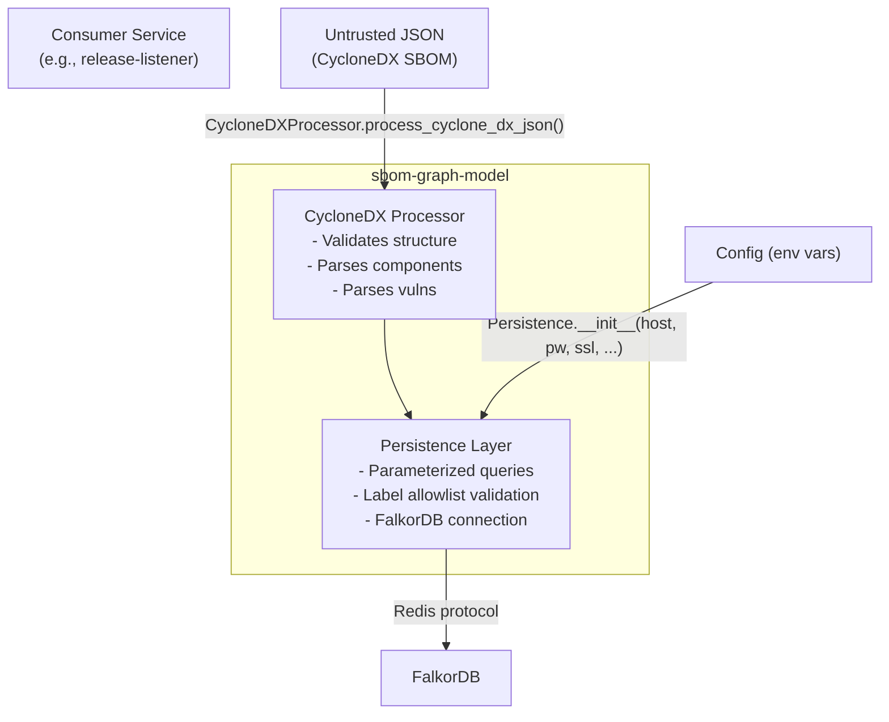

# Threat Model: sbom-graph-model

## Summary

`sbom-graph-model` is a shared Python library consumed by `sonatype-lifecycle-release-listener` (write path) and potentially other future consumers. It provides three capabilities: CycloneDX SBOM parsing, domain model classes, and FalkorDB graph persistence. Because it is a library (not a network service), it has no entry points of its own — all input arrives through calling code. The primary risks are **Cypher injection via label or query construction**, **malformed SBOM input causing unexpected behavior**, **credential handling for FalkorDB**, and **type confusion in loosely-typed CycloneDX fields**.

Existing mitigations are strong: parameterized Cypher queries, a node label allowlist with regex validation, and CycloneDX structure validation. The main residual risks are denial-of-service via very large SBOMs and implicit trust of FalkorDB connection parameters passed by callers.

## Assets and Trust Boundaries

### Assets

| Asset | Location | Sensitivity |
|-------|----------|-------------|
| FalkorDB password | Passed to `Persistence.__init__` via caller | **Critical** — write access to entire graph |
| FalkorDB TLS CA path | Passed to `Persistence.__init__` via caller | **High** — trust anchor for TLS verification |
| Graph data integrity | FalkorDB graph manipulated by persistence layer | **High** — dependency and vulnerability data |
| CycloneDX SBOM content | Parsed from JSON dict in `CycloneDXProcessor` | **Medium** — untrusted external data |
| Cypher query strings | Constructed in `persistence.py` | **High** — injection vector if mishandled |

### Entry Points (Library API)

| Entry Point | Caller | Trust Level |
|-------------|--------|-------------|
| `Persistence.__init__(host, port, password, ...)` | Consumer service | Trusted (internal config) |
| `CycloneDXProcessor.process_cyclone_dx_json(json_data)` | Consumer service | **Untrusted** — JSON from external SonaType API |
| `Persistence.create_project_version(version)` | CycloneDX processor | Semi-trusted — parsed from SBOM |
| `Persistence.create_defect(defect)` | CycloneDX processor | Semi-trusted — parsed from SBOM |
| `Persistence.create_dependency(parent, child)` | CycloneDX processor | Semi-trusted — parsed from SBOM |
| `Persistence.run_query(query, params)` | Internal / advanced callers | Trusted |

### Trust Boundaries

## Threat Analysis (STRIDE)

| # | Threat | STRIDE | Asset | Likelihood | Impact | Risk | Status | Detail |
|---|--------|--------|-------|------------|--------|------|--------|--------|
| 1 | Cypher injection via node label | E, T | Graph data, Cypher queries | **Low** | **Critical** | **Medium** | **MITIGATED** | `project_type` is interpolated into f-string queries. Mitigated by `_validate_label()` which checks against `ALLOWED_PROJECT_TYPES` frozenset AND validates against `_SAFE_IDENTIFIER_RE`. Both checks must pass. |
| 2 | Cypher injection via query parameters | T, E | Graph data | **Low** | **Critical** | **Low** | **MITIGATED** | All data values are passed via `$param` parameterized queries. FalkorDB/Redis protocol handles escaping. No user data is interpolated into query strings. |
| 3 | Malformed SBOM causes unhandled exception | D | Service availability | **Medium** | **Medium** | **Medium** | **PARTIALLY MITIGATED** | `_validate_cyclonedx_structure()` checks top-level structure (metadata, component, bom-ref, name, section types). However, individual component fields (version, group, purl) are accessed via `.get()` without type validation — a string field containing a dict would propagate silently. |
| 4 | Type confusion in CycloneDX fields | T | Graph data integrity | **Medium** | **Medium** | **Medium** | **OPEN** | Component fields like `name`, `group`, `version`, `purl` are extracted with `.get()` and passed directly to Cypher parameters. If a field contains an unexpected type (list, dict, int), FalkorDB will store it as-is, potentially corrupting graph semantics or causing query failures downstream. |
| 5 | FalkorDB password logged or exposed | I | FalkorDB credentials | **Low** | **High** | **Medium** | **MITIGATED** | Password is passed to `FalkorDB()` constructor and not logged. `logger.debug` logs query params but password is not included in query params. However, if `repr(self.db)` or exception traces include connection details, the password could leak to log output. |
| 6 | FalkorDB connection without TLS | I | FalkorDB password, graph data | **Medium** | **High** | **High** | **PARTIALLY MITIGATED** | `ssl` defaults to `True` in `Persistence.__init__`, which is a secure default. However, callers can pass `ssl=False` and there is no warning or guard. If TLS is disabled, the password and all graph data traverse the network in plaintext. |
| 7 | Denial of service via oversized SBOM | D | Service availability, FalkorDB | **Medium** | **Medium** | **Medium** | **OPEN** | No limit on the number of components, dependencies, or vulnerabilities processed. A SBOM with millions of entries would generate millions of Cypher queries, consuming CPU, memory, and FalkorDB resources. The library has no built-in circuit breaker. |
| 8 | Node label injection via unknown project type | E, T | Graph data | **Low** | **High** | **Low** | **MITIGATED** | If `project.type` is not in `ALLOWED_PROJECT_TYPES`, `_validate_label()` raises `ValueError`, aborting the operation. The type defaults to `"Library"` which is in the allowlist. |
| 9 | Repudiation — no audit trail for graph writes | R | Graph data integrity | **Medium** | **Low** | **Low** | **OPEN** | The library logs operations at INFO level (project name, version, defect ID) but does not produce structured audit events with caller identity, timestamp, or payload hashes. Attribution depends entirely on the consuming service. |
| 10 | Information disclosure via error messages | I | Internal structure | **Low** | **Low** | **Low** | **OPEN** | `ValueError` and `CycloneDXValidationError` messages include field names and values from the SBOM. If propagated to HTTP responses by the consumer, they could reveal internal processing details. |
| 11 | Unsafe `run_query` allows arbitrary Cypher | E | Graph data | **Low** | **Critical** | **Medium** | **ACCEPTED** | `run_query()` is a public method accepting any Cypher string. A compromised or buggy consumer could execute arbitrary graph operations. This is by design — the library must provide query flexibility — but increases the trust requirement on consumers. |
| 12 | Vulnerability rating with multiple entries | D | Service availability | **Low** | **Low** | **Low** | **MITIGATED** | `parse_defect_from_cyclone_dx()` raises `ValueError` if a vulnerability has multiple ratings. This prevents processing but doesn't crash the service if the caller handles the exception. |

## Security Controls in Place

| Control | Location | Effectiveness |
|---------|----------|---------------|
| Parameterized Cypher queries (`$param`) | All `persistence.py` methods | **Strong** — prevents value-based injection |
| Node label allowlist (`ALLOWED_PROJECT_TYPES`) | `_validate_label()` | **Strong** — 10 allowed values, checked before interpolation |
| Safe identifier regex (`_SAFE_IDENTIFIER_RE`) | `_validate_label()` | **Strong** — defense in depth against label injection |
| CycloneDX structure validation | `_validate_cyclonedx_structure()` | **Moderate** — validates required top-level fields and types |
| SSL default `True` | `Persistence.__init__` | **Moderate** — secure default but overridable |
| Internal prefix validation | `__init__` and `parse_internal_prefixes()` | **Strong** — rejects invalid field names |
| `LiteralString` type annotation | `run_query()` signature | **Weak** — documentation-only, not enforced at runtime |
| Null checks on all persistence methods | All `create_*` methods | **Moderate** — prevents NoneType errors |

## Third-Party Component Assessment

| Criterion | falkordb (Python client) | FalkorDB (server) |
|-----------|--------------------------|---------------------|
| CVEs (last 2yr) | 0 | 0 |
| Last release | 2024 | 2024 |
| Maintenance | Active | Active |
| Contributors | 5+ | 20+ |
| License | MIT | Server-Side PL |
| **Risk** | Low | Low (server license restricts hosting as a service) |

The `falkordb` Python client is a thin wrapper over the Redis protocol. Its attack surface is minimal. The main concern is that it delegates TLS verification to the Python `ssl` module and `redis-py`, which are well-tested.

## Recommendations

### High Priority

| # | Threat | Recommendation | Effort |
|---|--------|----------------|--------|
| 6 | FalkorDB without TLS | Log a warning when `ssl=False` is passed. Consider raising an error in production mode (detectable via an environment variable). | Low |
| 4 | Type confusion in fields | Add type assertions for string fields extracted from CycloneDX components (name, group, version, purl, type). Reject or coerce non-string values. | Low |
| 7 | Oversized SBOM DoS | Add configurable limits on component count, dependency count, and vulnerability count in `process_cyclone_dx_json()`. Log and reject SBOMs exceeding thresholds. | Low |

### Medium Priority

| # | Threat | Recommendation | Effort |
|---|--------|----------------|--------|
| 3 | Malformed SBOM fields | Extend `_validate_cyclonedx_structure()` to validate component field types (name must be string, version must be string or None). | Low |
| 9 | No audit trail | Add structured logging with a consistent schema (operation, caller, entity IDs, timestamp) for all write operations. | Medium |
| 11 | Open `run_query` API | Document the security contract: callers MUST NOT pass user-controlled strings as query text. Consider adding a `_run_query` private variant and keeping the public one for advanced use only. | Low |

### Low Priority

| # | Threat | Recommendation |
|---|--------|----------------|
| 10 | Error message info disclosure | Ensure consuming services catch `CycloneDXValidationError` and `ValueError` and return generic messages to external callers. |
| 5 | Password in exception traces | Ensure FalkorDB constructor exceptions are caught and re-raised without connection details. |
| 12 | Multiple ratings ValueError | Consider logging and selecting the highest-severity rating instead of raising, to improve resilience. |

## API Exposure via sbom-graph-api

The `sbom-graph-model` library is now directly exposed to external input through `POST /ingest/cyclonedx` in `sbom-graph-api`. This means:

- **CycloneDX JSON from untrusted clients** is passed to `CycloneDXProcessor.process_cyclone_dx_json()` after JWT authentication.
- The structural validation in `_validate_cyclonedx_structure()` is now a security-critical control (not just a correctness check).
- The label allowlist and parameterized queries in `Persistence` are the primary defense against Cypher injection from SBOM field values.

Relevant system-level threats: S11, S12, S13, S14 in [`threat-model.md`](../threat-model.md).

## Residual Risk

| Risk | Severity | Justification |
|------|----------|---------------|
| Arbitrary Cypher via `run_query` | Medium | By design. Consumers are internal services under our control. Access to the library implies access to FalkorDB credentials anyway. |
| Large SBOM resource consumption | Medium | No built-in limits. Gunicorn timeouts and Kubernetes resource limits in consuming services provide backstops. `sbom-graph-api` enforces a 50 MB `MAX_CONTENT_LENGTH`. |
| FalkorDB client library vulnerability | Low | Actively maintained, no known CVEs. Thin Redis protocol wrapper with minimal attack surface. |
| CycloneDX spec evolution | Low | Future CycloneDX versions may introduce new field types or structures not handled by current validation. |
| Structurally valid but misleading SBOM data via ingest API | Medium | An authenticated user can submit a valid CycloneDX document containing fabricated dependency or vulnerability data. Mitigated by requiring JWT authentication. Audit logging of ingestion events is recommended. |

## Revision History

| Date | Author | Changes |
|------|--------|---------|
| 2026-03-02 | AI-assisted threat model | Initial STRIDE analysis for sbom-graph-model library |
