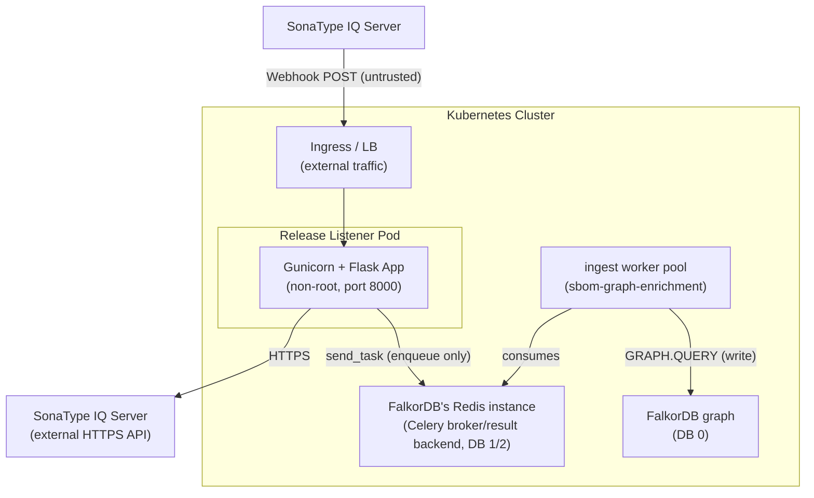

# Threat Model: Sonatype Lifecycle Release Listener

## Summary

The sonatype-lifecycle-release-listener is a Flask microservice that receives webhook notifications from SonaType IQ Server, fetches CycloneDX SBOMs and VEX documents via the SonaType API, and enqueues them onto the `ingest` Celery queue for asynchronous processing by the `sbom-graph-enrichment` worker pool. It no longer writes to FalkorDB's graph directly (migrated from a synchronous direct-write design); it acts as a bridge between an external CI/CD system and the shared Celery broker, not the graph database itself.

The primary risks center on the **unauthenticated webhook endpoint**, **SSRF potential through unvalidated input**, and **information disclosure in error responses**. The service handles SonaType API credentials and the shared broker/result-backend Redis credential (the same instance FalkorDB runs on, different logical DBs), making credential management a critical concern.

## Assets and Trust Boundaries

### Assets

| Asset | Location | Sensitivity |
|-------|----------|-------------|
| SonaType API credentials | `SONATYPE_USERNAME`, `SONATYPE_PASSWORD` env vars | **Critical** -- read access to all SBOMs |
| Celery broker/result-backend credential | `FALKORDB_PASSWORD` env var (same Redis instance as FalkorDB, DB 1/2) | **High** -- ability to enqueue arbitrary ingest jobs |
| CA certificate bundles | `/app/certs/ca_bundle.pem` | **High** -- TLS trust anchor |
| FalkorDB graph data | Not directly reachable from this service -- integrity depends on the `ingest` worker pool's validation | **High** -- integrity of dependency data, but the write path itself now lives in `sbom-graph-enrichment` |
| SonaType SBOM/VEX data | Fetched via HTTPS, transient | **Medium** -- dependency metadata |
| Webhook payloads | In-memory during processing | **Low** -- event metadata |

### Entry Points

| Entry Point | Protocol | Auth Required |
|-------------|----------|---------------|
| `/webhook` (POST) | HTTP | **None** |
| `/health` (GET) | HTTP | None |

### Trust Boundaries

**Trust boundary crossings:**
1. **External -> Cluster**: Webhook POST from SonaType (or any caller) crosses the cluster boundary
2. **Cluster -> External**: HTTPS request to SonaType API to fetch SBOMs and VEX documents
3. **App -> Broker**: Enqueues `ingest_cyclonedx`/`ingest_vex` jobs onto the `ingest` Celery queue (a Redis `LPUSH`, not a graph write). The actual graph write happens later, in the `ingest` worker pool -- a separate trust boundary crossing covered by `sbom-graph-enrichment/threat-model.md`.

## Threat Analysis (STRIPED)

| # | Threat | STRIPED | Asset | Likelihood | Impact | Risk | Status | Detail |
|---|--------|---------|-------|------------|--------|------|--------|--------|
| 1 | Unauthenticated webhook ingestion | S, T | Graph data integrity | **High** | **High** | **Critical** | **MITIGATED** | `/webhook` now verifies an HMAC-SHA1 signature (`X-Nexus-Webhook-Signature`) against `WEBHOOK_SECRET` before processing anything, and fails closed (rejects with 503) if the secret isn't configured. *(This finding predates the async-ingest migration -- HMAC verification was already present in the code before that work; this entry was simply never updated to match.)* |
| 2 | SSRF via `app_id` in SonaType API URL | S, T | SonaType credentials, internal network | **Medium** | **High** | **High** | **MITIGATED** | `app_id` is validated against `_SONATYPE_ID_RE` (`^[a-fA-F0-9]{32}$`) and rejected with 400 before it ever reaches the SonaType API URL, which rules out path traversal characters. *(Also predates the async-ingest migration; the format check was already in place.)* |
| 3 | Internal error details leaked to callers | I | Server internals | **Medium** | **Medium** | **Medium** | **MITIGATED** | Error responses return generic messages (`"Internal processing error"`, `"Failed to process release scan"`) plus a `request_id` for server-side correlation -- never `str(exc)`. `RedisError` no longer applies since the migration to async ingest removed direct FalkorDB access; the analogous failure mode is now a `RuntimeError` raised when enqueueing onto the `ingest` queue fails, which is caught and sanitised the same way. |
| 4 | No request size limit on webhook | D | Application availability | **Medium** | **Medium** | **Medium** | **MITIGATED** | `app.config["MAX_CONTENT_LENGTH"] = 1 * 1024 * 1024` (1 MB) is set in `create_app`. *(Predates the async-ingest migration.)* |
| 5 | No rate limiting on webhook | D | Application availability, SonaType API, `ingest` queue | **Medium** | **Medium** | **Medium** | **OPEN** | Unlimited requests to `/webhook` can trigger unbounded SonaType API calls and `ingest` queue enqueues, potentially causing SonaType rate-limit lockout or (per the `sbom-graph-enrichment` incident this queue has already seen once) broker backlog growth. |
| 6 | SonaType credentials in memory across requests | I | SonaType API credentials | **Low** | **High** | **Medium** | **ACCEPTED** | `SonaTypeClient` stores credentials as instance attributes. A new `CycloneDXHelper`/`VexHelper` (and therefore new `SonaTypeClient`) is created per webhook request, so credentials are short-lived, but remain in the process address space. Inherent to the architecture. |
| 7 | Broker connection without TLS in umbrella chart | I | Broker credential, `ingest` queue integrity | **Low** | **Medium** | **Low** | **MITIGATED** | The umbrella chart's `sonatype-lifecycle-release-listener-deployment.yaml` sets `FALKORDB_SSL`, mounts the shared CA bundle, and sets `FALKORDB_CACERTS`/`FALKORDB_CLIENT_CERT`/`FALKORDB_CLIENT_KEY` whenever `falkordb.tls.enabled` -- the same wiring `sbom-graph-api` and the enrichment worker use. `celery_client.py` honours these via `FALKORDB_SSL`. *(This finding also predates the async-ingest migration -- the chart already had this wired up for the old `Persistence`-based TLS connection; it was simply never marked resolved.)* |
| 8 | No webhook payload schema validation | T | `ingest` queue integrity | **Medium** | **Medium** | **Medium** | **OPEN** | Beyond checking for `applicationEvaluation`, `stage`, `id`, and `publicId` (with format validation on the latter two), no full JSON schema validation is performed. Malformed or oversized nested structures pass through to the SonaType fetch and, if a real `app_id` is guessed/leaked, the `ingest` worker's CycloneDX/VEX processors. |
| 9 | No audit logging for webhook actions | R | Compliance, forensics | **Medium** | **Low** | **Low** | **OPEN** | Webhook processing is logged at INFO level with a `request_id` and `webhook_id`/`public_id`, but there is no structured audit trail (source IP, payload hash). Actions cannot be reliably attributed or investigated end-to-end (this listener enqueues; `sbom-graph-enrichment`'s own logs would need correlating by `record_id`/`job_id` to trace a webhook through to a graph write). |
| 10 | `FLASK_DEBUG` can be enabled in production | I, E | Server internals | **Low** | **High** | **Medium** | **OPEN** | `FLASK_DEBUG` defaults to `false` and only affects the `if __name__ == "__main__"` dev-server entry point (production runs under Gunicorn, which ignores it), but there is still no explicit guard rejecting `FLASK_DEBUG=true` for defence-in-depth against a misconfigured non-Helm deployment. |
| 11 | No input sanitization on `app_id` / `public_id` | T | SonaType API, logs | **Medium** | **Medium** | **Medium** | **MITIGATED** | Both are validated against `_SONATYPE_ID_RE` (`^[a-fA-F0-9]{32}$`) and `_PUBLIC_ID_RE` (`^[a-zA-Z0-9._-]{1,256}$`) with a 400 rejection on mismatch, before either is used in a URL or logged. *(Predates the async-ingest migration.)* |
| 12 | CycloneDX SBOM processing resource consumption | D | Application availability | **Low** | **Low** | **Low** | **REDUCED** | The multi-step graph parse-and-persist work (the actual CPU/memory-heavy part) now runs in the `ingest` worker pool, not this service. The webhook request itself only fetches the SBOM/VEX JSON from SonaType and enqueues it, so peak memory in this process is now roughly one SBOM's JSON payload rather than the full parse-and-persist working set. Large-SBOM resource exhaustion risk has moved to `sbom-graph-enrichment` (which already sizes for it -- see its own threat model / `docs/ingest-pipeline.md` §5.2). |
| 13 | Credential exposure if CA cert missing | I | SonaType credentials | **Low** | **High** | **Medium** | **OPEN** | If `SONATYPE_CACERTS` points to a non-existent file, `requests.Session.verify` will fail. However, if `verify` is set to a path that doesn't exist, `requests` raises an error rather than falling back to unverified. The error message could leak the path. If misconfigured to `verify=False`, credentials would be sent over unverified TLS. |
| 14 | New client per request | D | Application performance | **Low** | **Low** | **Low** | **REDUCED** | Each webhook request still creates a new `SonaTypeClient` (short-lived `requests.Session`), but no longer opens a FalkorDB connection at all -- `Persistence` was removed from this service entirely as part of the async-ingest migration. The Celery client used to enqueue is a lazy, thread-safe, process-wide singleton (`celery_client.get_celery_client()`), not created per request. |

## Security Controls in Place

### Positive Controls
- **Webhook HMAC verification**: `X-Nexus-Webhook-Signature` (HMAC-SHA1) verified via `hmac.compare_digest` against `WEBHOOK_SECRET`; fails closed if the secret isn't configured
- **`app_id`/`public_id` format validation**: `_SONATYPE_ID_RE`/`_PUBLIC_ID_RE` reject malformed values with 400 before they reach the SonaType API URL or logs
- **Request body size limit**: `MAX_CONTENT_LENGTH` capped at 1 MB
- **Sanitised error responses**: generic messages plus a `request_id` for server-side correlation; no `str(exc)` ever returned to the caller (CWE-209)
- **No direct FalkorDB access**: this service holds no graph-write capability at all since the async-ingest migration -- Cypher injection, label-allowlist bypass, and CycloneDX/SPDX structural validation are `sbom-graph-enrichment`'s concerns now (see its own threat model), not this one's
- **TLS to SonaType**: `requests.Session.verify` is set to a CA bundle path; HTTPS enforced for API calls
- **TLS to the Celery broker**: `celery_client.py` honours `FALKORDB_SSL`/`FALKORDB_CACERTS`/`FALKORDB_CLIENT_CERT`/`FALKORDB_CLIENT_KEY`, mounted by the umbrella chart whenever `falkordb.tls.enabled`
- **Distroless container**: Minimal attack surface, no shell, no package manager
- **Non-root execution**: UID 65532 (daemon), read-only root filesystem
- **Kubernetes security context**: `allowPrivilegeEscalation: false`, `capabilities.drop: ALL`, `runAsNonRoot: true`
- **Secrets via Kubernetes Secrets**: SonaType and broker credentials injected via `secretKeyRef`
- **Health check endpoint**: `/health` returns simple JSON, no sensitive data
- **Idempotent ingest**: the enqueued `record_id` is a deterministic `uuid5` over `public_app_id` + a content hash, so a re-delivered webhook converges to the same graph state instead of duplicating

### Missing Controls
- No rate limiting
- No structured audit logging (source IP, payload hash)
- No full JSON schema validation on webhook body (only key presence + `app_id`/`public_id` format)
- No guard against debug mode in production (low real-world impact -- Gunicorn ignores the flag)

## Third-Party Component Assessment

| Criterion | Flask 3.x | Gunicorn 23.x | requests 2.x | celery 5.x | redis-py 5.x |
|-----------|-----------|---------------|--------------|------------|--------------|
| CVEs (last 2yr) | 0 | 0 | 0 | 0 | 0 |
| Last release | 2025 | 2024 | 2025 | 2026 | 2025 |
| Maintenance | Very active | Active | Very active | Very active | Very active |
| License | BSD-3 | MIT | Apache-2 | BSD-3 | MIT |
| **Risk** | Low | Low | Low | Low | Low |

**Note**: `sbom-graph-model` was removed as a dependency during the async-ingest migration -- this service no longer parses or persists SBOMs itself, only fetches raw JSON from SonaType and enqueues it.

**Note**: `flask-jwt-extended` is listed as a dependency in `pyproject.toml` but is not used in the sonatype-lifecycle-release-listener code. It should be removed to reduce attack surface.

## Recommendations

Findings 1, 2, 3, 4, 7, and 11 (previously listed as Critical/High) are now
**MITIGATED** per the Threat Analysis table above -- HMAC auth, `app_id`/
`public_id` format validation, request size limits, and TLS wiring were
already implemented before the async-ingest migration; sanitised error
responses were confirmed correct against the current code during this
audit. Only #10 remains open from the original Critical/High set.

### Medium (Plan for Future)

| # | Finding | Recommendation |
|---|---------|----------------|
| 10 | Debug mode unguarded | Add a startup check that rejects `FLASK_DEBUG=true` when a production indicator is present, or remove the toggle entirely since Gunicorn (the actual production entry point) ignores it. Low real-world impact but cheap to close. |
| 5 | No rate limiting | Implement rate limiting via ingress annotations (e.g., `nginx.ingress.kubernetes.io/limit-rps`) or an API gateway -- now also relevant as backpressure on the `ingest` queue, not just the SonaType API. |
| 8 | No schema validation | Add JSON schema validation for the webhook payload to reject unexpected structures early. |
| 9 | No audit logging | Add structured audit log entries for each webhook: source IP, payload hash, `app_id`, `public_id`, `record_id`/`job_id`, duration -- the `record_id`/`job_id` correlation is what would let this be traced through to the `sbom-graph-enrichment` worker logs. |

### Low (Housekeeping)

| Finding | Recommendation |
|---------|----------------|
| Unused `flask-jwt-extended` dependency | Still present in `pyproject.toml` and still unused in `src/`. Remove to reduce attack surface and image size. |
| `gunicorn.conf.py` SSL commented out | Either remove the commented SSL lines or document that TLS termination is handled by ingress. |
| `umask = 0` in gunicorn config | Set to `0o077` to ensure files created at runtime have restrictive permissions. |

## Residual Risk

| Risk | Severity | Justification |
|------|----------|----------------|
| SonaType credentials in process memory | Medium | Inherent to the architecture. Credentials are short-lived per request. Container memory is not swapped (distroless). Kubernetes Secrets provide at-rest encryption. |
| SBOM/VEX JSON held in memory to enqueue | Low | Reduced from the pre-migration risk: this service only holds one document's raw JSON briefly (to hash and pass as task args), not the full parsed graph working set. The heavier resource risk moved to `sbom-graph-enrichment`, which sizes for it explicitly. |
| Transitive dependency vulnerabilities | Medium | Lockfile pinning, CI/CD scanning (Snyk/SonaType), and automated patch PRs mitigate. |
| `ingest` queue shared fate with `sbom-graph-enrichment` | Medium | This service's enqueue call is a thin `send_task`; it has no visibility into or control over queue depth, worker health, or the backpressure/dispatch-guard logic that lives in `sbom-graph-enrichment`. A stalled `ingest` worker pool degrades this service's effective SLA even though its own code is healthy. |

## Revision History

| Date | Author | Changes |
|------|--------|---------|
| 2026-07-28 | AI-assisted threat model | Re-verified every finding against the current implementation. Documented the async-ingest migration (no more direct `Persistence`/FalkorDB access; enqueues onto the `ingest` Celery queue instead) and re-scoped the affected assets, trust boundary diagram, threats #3/#6/#7/#12/#14, Security Controls, and Third-Party Component Assessment accordingly. Separately corrected findings #1, #2, #4, #7, #11 to **MITIGATED** -- HMAC auth, input validation, request size limits, and TLS wiring were already implemented in the code and chart before this migration; this document had simply never been updated to match and was stale independent of the migration. |
| 2026-03-01 | AI-assisted threat model | Initial STRIPED analysis |
